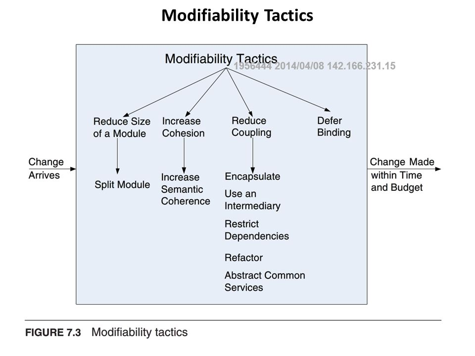
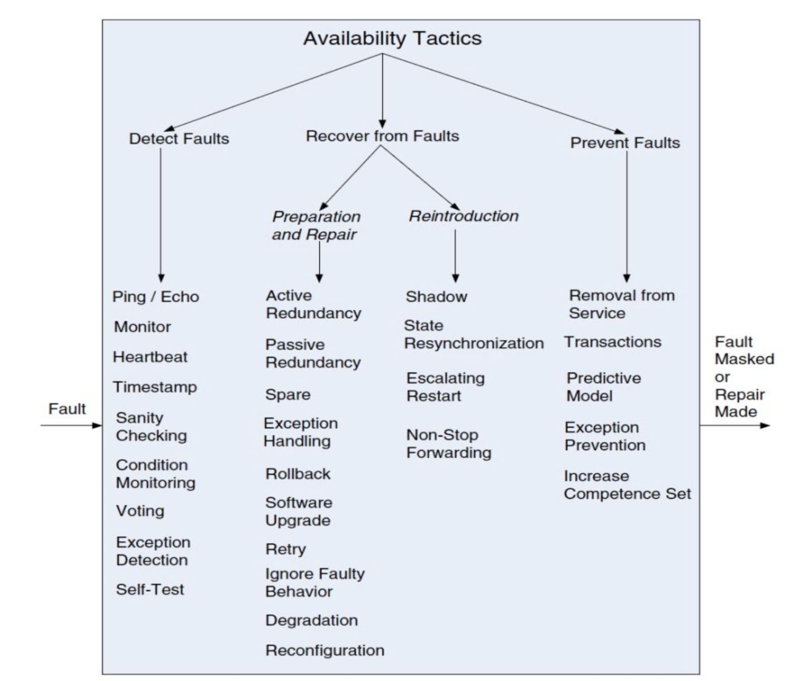
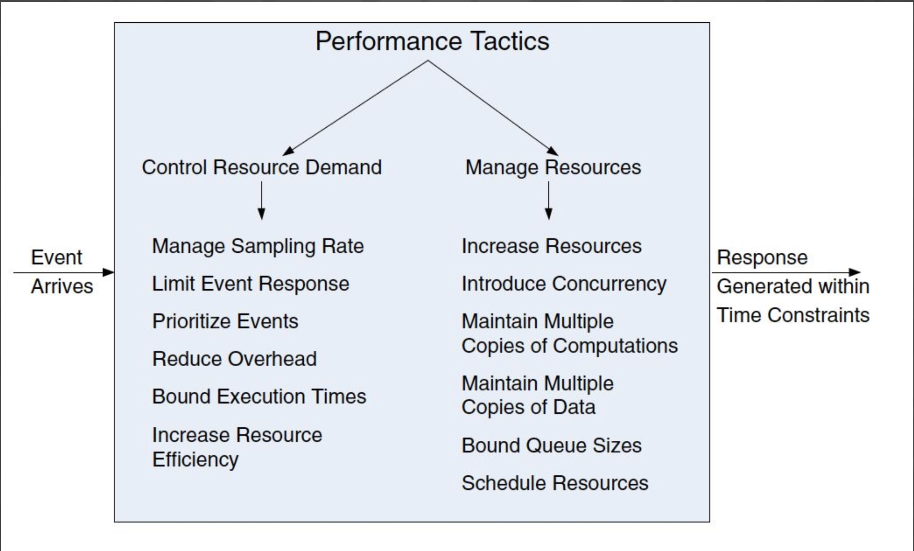
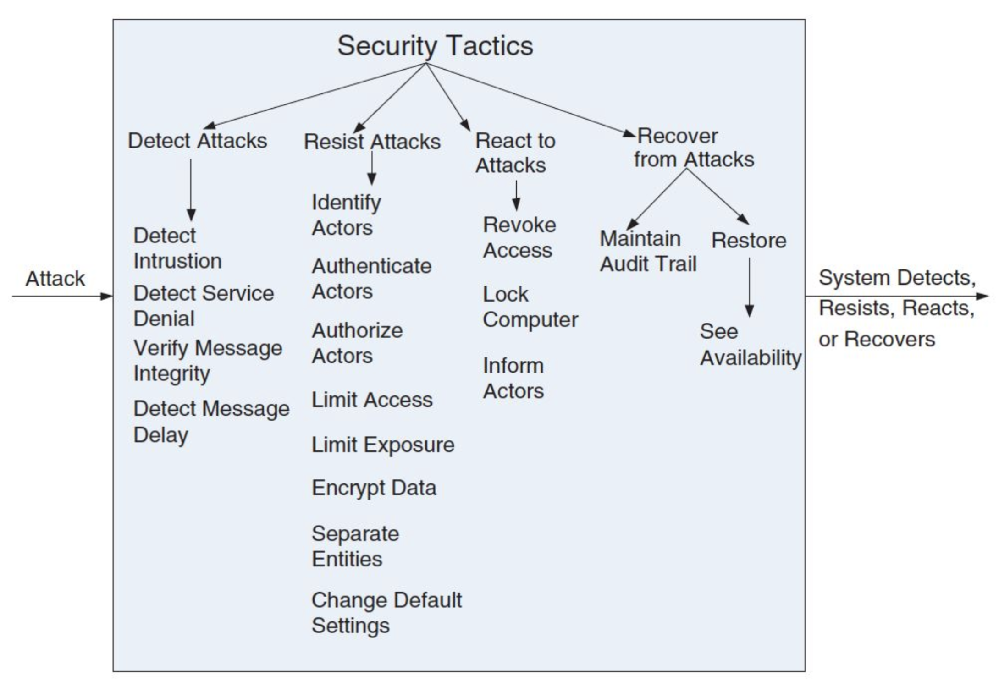
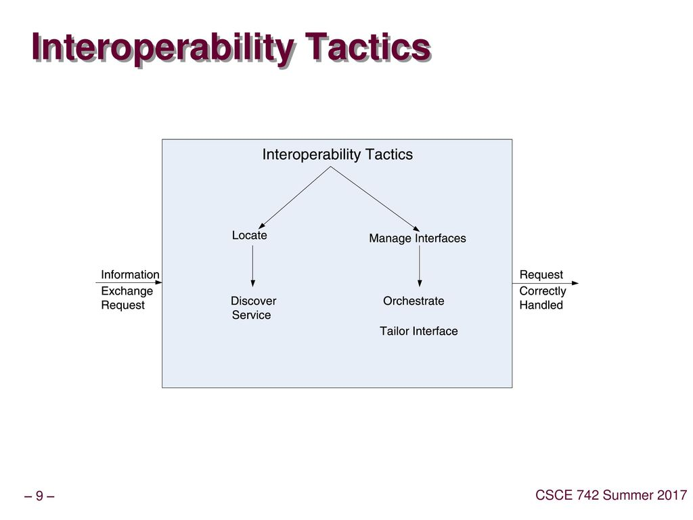
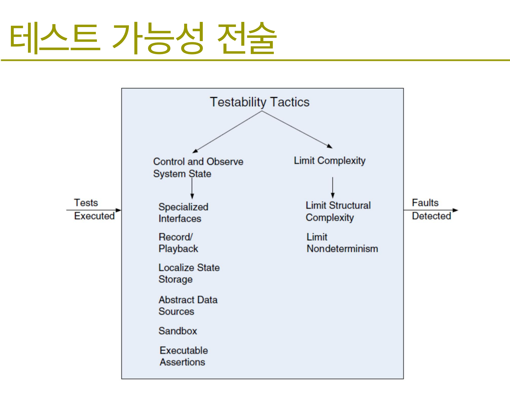
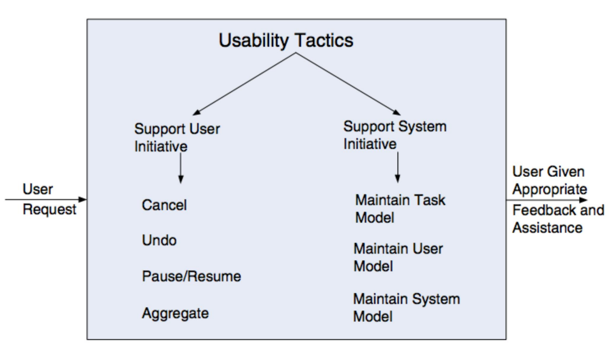

# 아키텍처 전술

`아키텍처 전술`이란 하나의 구조 또는 연산 메커니즘만 사용하여 **하나의 아키텍처 영역만을** 해결한다는 의미이다. 이러한 전술은 원소적이고 패턴은 분자적이라고 말할 수 있으며 대부분의 패턴은 전술로 구성된다. 아키텍처 전술은 Computer Science적인 기법과 소프트웨어 구조로 문제가 포함되어 있으며 주로 소프트웨어 아키텍처를 수립하고 품질 속성을 높이는 데 사용된다.

## 품질 속성 및 아키텍처

- 설계의 초기 단계부터 품질 속성을 고려해야 한다.
  - 다양한 품질 속성의 달성은 초기 아키텍처 설계에서 결정된다.
  - 일반적으로 기능을 구현한 다음, 돌아가서 품질 속성을 추가할 수는 없다.
- 품질 속성은 아키텍처 설계 또는 구현에 전적으로 의존하지는 않는다.
  - 예를 들어 성능 요구사항은 아키텍처가 아닌 알고리즘 선택으로 달성할 수 있다.

## 아키텍처 전술의 주요 품질 지수

- 변경용이성(Modificability)
- 가용성(Availability)
- 성능성(Performance)
- 보안성(Security)
- 상호 운용성(Interoperability)
- 테스트 가능성(Testablility)
- 사용 용이성(Usability)

## Modificabiltiy

`변경용이성`은 변화에 대한 부분으로 **변화와 관련한 Risk와 Cost**에 대한 부분이다. 당연한 말이지만 Risk와 Cost를 줄여 주어야 변경이 용이하다.

### Tactics

- `Split Module`: 모듈을 더 작은 단위로 나누면 변경의 평균 비용을 줄일 수 있다.
- `Reduce Coupling`
- `Encapsulate`
- `Use an Intermediary`: Broker(중재자)가 종속성을 끊어준다.
- `Restrict Dependencies`: Layered architecture, Wrapper
- `Refactor`
- `Abstract common services`
- `Increase cohension`
- `Increase Semantic Coherence`: 의미 일관성 증가를 의미한다. 한 모듈을 변경하는 것이 책임에 영향을 미치지만, 모듈의 일부 책임에는 영향을 미치지 않는 경우 해당 책임은 다른 모듈에 배치되어야 한다.
- `Defer binding`: 런타임에 등록하는 것을 말한다. 플러그 앤 플레이, Configuration 파일, 시작시 매개 변수 설정, 다형성 메서드 호출의 동적 바인딩 등이 있다.

## Availability

`Reliability`는 **주어진 환경에서 특정 목적을 위해 지정된 시간동안 고장 없이 운영될 수 있는 확률**로써 시스템의 서비스가 지정한 대로 올바르게 전달될 확률을 말한다. `Availability`는 **주어진 시점에서 요청된 서비스가 제공되고 운영될 수 있는 확률**로써 사용자가 서비스를 요청했을 때 서비스를 제공할 수 있는 확률을 말한다. 시스템이 응답을 하면 일단 Availability를 만족하는 것이고 올바른 결과값을 주는지 안 주는지와는 상관이 없다. 올바른 결과값을 주는지에 대해서는 Reliability에서 적용이 된다.

Availability에서는 **실패가 중요**하며 실패가 될 수 있는 **오류를 사전에 파악**하는 것도 중요하고 실패가 발생할 경우 **복구와 수리를 얼마나 빠르게 하느냐**도 중요하다. 따라서 대표적인 접근 방법으로는 중복(redundancy), 실패 감지를 위한 모니터링, 실패 감지 시 복구(자동 또는 수동) 등이 있습니다.

### 결함검출(Fault Detection) Tactics

- `Ping/echo`: 하나의 컴포넌트에서 검사대상 컴포넌트로 이벤트 발생
- `모니터`: 시스템의 다양한 부분(프로세스, I/O, 메모리 등)의 상태를 모니터
- `Heart Beat`: 한쪽에서 심장박동 메시지를 보내면 다른 쪽에서 청취함, 심장 박동 메시지가 없으면 전송 컴포넌트가 실패한 것으로 간주
- `타임 스탬프`: 이벤트가 발생한 후에 즉시 이벤트에 local check를 설정
- `Sanity Checking`: 컴포넌트의 동작 또는 출력의 유효성이나 합리성을 검사, 특정한 정보의 흐름을 검사하기 위해 인터페이스에서 주로 사용
- `조건 모니터링(Condition Monitoring)`: 프로세스나 디바이스의 조건을 검사하거나 설계 시에 이뤄진 가정을 조사
- `Voting`: 같은 일을 하는 세 개의 컴포넌트를 사용하여 동일한 입력을 받아서 투표 로직에 자신의 출력을 보내 세 개의 출력 상태 사이의 비 일관성을 찾아내는데 사용
- `Self Test`: 컴포넌트가 정확한 오퍼레이션을 하고 있는지 스스로 테스트를 수행

### 오류복구(Fault Recovery) Tactics

- `Active Redundancy`: 병렬로 동일한 입력을 받아서 처리하고 예비 노드는 활성 노드와 동기적 상태를 유지
- `Passive Redundancy`: 하나의 활성노드만 유지
- `Spare`: 예비 노드는 실패 복구가 발생할 때까지 작동하지 않는다.
- `Shadow Operation`: 이전의 컴포넌트를 그림자 모드로 동작하게 한 후 해당 컴포넌트를 활성 역할로 복귀
- `State Resynchronization`
- `Checkpoint / Rollback`: 실패가 발생하면 바로 이전의 안정적인 상태로 Rollback 수행

## Performance

주어진 시간 안에 시스템에 도달한 이벤트에 대한 응답을 생성한다.

### Tactics

- `자원 소비(Resource Comsumption)`
- `차단되어 있는 시간(Blocked Time)`
- `자원경쟁`
- `자원가용성`
- `샘플링 속도 관리`
- `제한 이벤트 응답`
- `이벤트 우선 순위 지정`
- `오버헤드 감소`: 중개자 또는 구성요소 체인 제거, 비효율적인 리소스의 주기적인 제거(해시 테이블의 재초기화)
- `바인딩된 실행 시간`: 실행시간에 제한을 둔다. 반복 횟수를 제한하는 등의 방법이 있다. 덜 정확한 계산이 비용으로 지불될 수 있다.
- `자원 효율성 향상`: 중요한 영역에서 사용되는 알고리즘 개선
- `자원 증가`: 더 빠른 프로세서나 프로세서 추가, 메모리 추가, 더 빠른 네트워크
- `동시성 도입`: 적절한 스케쥴링 도입이 필요
- `일정 리소스`: 리소스에 대한 경합이 있을때 리소스를 예약할 수 있어야 한다.
- `계산의 여러 복사본 유지`: 여러 서버에서 계산을 분산(로드 밸런서)
- `데이터의 여러 복사본 유지`: 캐싱, 데이터 복제

## Security

Security는 공격을 저지하고 감지하고 복구하는 것이다.

### Tactics

- `사용자 인증`
- `사용자 인가`
- `데이터 기밀성 유지`
- `일관성 유지`
- `노출 제한`
- `접근 제한`

### 공격 감지 Tactics

- `침입탐지시스템`: 네트워크 패턴 비교를 통한 감지
- `패킷 필터링 기반`: 프로토콜, TCP 플래그, 탑재량(payload) 크기, 주소, 포트번호
- `서비스 거부 감지`: 기록된 프로필과 대조
- `메시지 무결성 확인`: 체크섬이나 해시값 이용
- `메시지 지연 감지`: 가로채기 공격 감지

### 공격 복구 Tactics

- `상태 회복`
- `공격자 식별`: 감사 기록 유지

## Interoperability

상호운영성은 2개 이상의 시스템이 인터페이스를 통하여 의미있는 정보를 얼마나 유용하게 공유하는지를 나타내는 정도이다.

### Locate Tactics

- `Discover Service`: Directory 서비스를 통하여 서비스 위치를 검색. 마이크로 서비스의 핵심적인 요소이다.

### Manage Interface Tactics

- `Orchestrate`: 특정 서비스를 운영 및 조율. 쿠버네티스가 그 예라 할 수 있다.
- `Tailor Interface`: 재단하듯이 상황에 맞게 인터페이스에 기능을 추가하거나 빼는 것

## Testablility

## Usability

### Tactics

- `Cancel`
- `Undo`
- `Pause/Resume`
- `Aggregate`: 사용자가 반복적인 작업을 수행하거나 동일한 방식으로 많은 개체에게 영향을 주는 작업은 그룹화가 필요하다.
- `작업 모델 유지(Maintain Task Model)`: 예를 들어 문장이 시작하는 위치에서 소문자를 수정하는 것
- `사용자 모델 유지(Maintain User Model)`: 예를 들어 사용자 모델은 모든 문서가 선택되지 않도록 마우스 선택 속도를 제어 할 수 있다.
- `시스템 모델 유지(Maintain System Model)`: 시스템 모델은 예상 되는 사용자에게 적절한 피드백을 제공할 수 있도록하는 시스템 동작이다. 예를 들어 현재 활동을 완료하는데 필요한 시간을 나타내는 진행률 표시줄이 있다.
