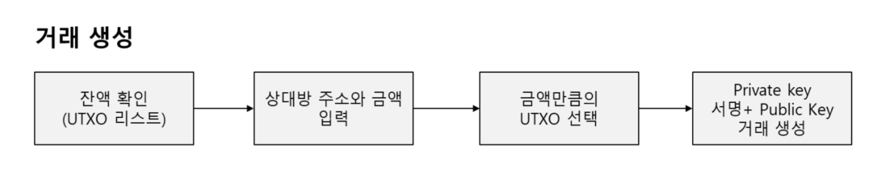

# 블록체인의 등장배경

## Bitcoin의 시작

2008년 금융위기로 인해서 중앙 금융기관과 정부의 부분별한 자금 발행에 대한 비판의식을 가진 Satoshi Nakamoto가 기관없이 거래 가능한 시스템 오픈

## CipherPunk

정부와 기관의 중앙집권화된 통제와 권력에서 벗어나 개인들의 자유와 사생활보호를 위해서 암호화된 체계 구축을 주장하는 활동 조직

### History

1982 Blind Signature

1990 DigiCash

1997 Hashcash

1998 B-Money

1998 Bit Gold

2008 Bitcoin

## Decentralize

탈중앙화란, 중앙화된 기관없이 사용자들간의 거래가 어떤 제한도 없이 이루어질 수 있는 환경을 뜻한다.

## Blockchain 4대 요소 기술

- 블록과 트랜잭션
- 분산 네트워크
- 암호화
- 합의 알고리즘

## Token Economy

## Blockchain Trilemma

Blockchain Trilemma는 Blockchain의 특성에 따라 3가지 중 2개 이상의 특징을 포함하는 Blockchain 플랫폼을 개발하는 것은 불가능하다는 것이다.

- Security
- Decentralization
- Scalability

### 분류

- 탈중앙성과 보안 : Bitcoin, Ethereum 1.0
- 탈중앙성과 확장성 : Ethereum 2.0
- 확장성과 보안 : Cosmos, Ripple, BBC

## Bitcoin 동작 방식

# 암호화 기술

## 대칭키와 비대칭키

## RSA

1. 공개키 암호시스템 RSA는 PKI(공개키 암호시스템)의 대표적인 알고리즘으로 1978년 처음 등장하였다.
2. 큰 수의 소인수 분해가 어렵다는 수학적 특징을 이용한 알고리즘으로 양자 컴퓨터 등장 시 무용지물 될 가능성이 존재한다. 하지만 이는 비단 블록체인만의 문제가 아니다.
3. 비대칭키 방식이란 공개키와 비밀키 두 개를 사용한 비대칭키 방식으로 어떤 키로 암호화 하느냐에 따라 다른 방식을 제공한다.
4. RSA 2048은 2048개의 bit를 사용하는 가장 대중적인 알고리즘으로 인터넷 뱅킹의 대부분이 사용 중이다.

## El Gamal 방정식(이산대수 문제의 어려움)

1. 두 소수 p, q 를 생성한다.
2. p-1, q-1과 각각 서로서인 정수 e를 준비한다.
3. ed를 (p-1)(q-1)으로 나눈 나머지가 1이 되도록 하는 d를 찾는다.
4. N = pq를 계산한 후, N과 e를 공개한다.
5. p, q, (p-1)(q-1)를 파기한다. 공개키는 e가 되고, d는 개인키가 된다.

## 공인인증서

공인인증서는 RSA-2048 알고리즘으로 발행된 X509 표준의 인증서이다. 공개키와 개인키를 포함하여 발급되며 개인키는 사용자의 PC에 저장되고 공개키는 사용자와 AD(Active Directory)에 모두 저장되는 형태이다.

## SSL 인증서

HTTPS는 HTTP Protocol 위에 데이터 송수신 데이터의 안전한 전송을 위해서 진행하는 SSL 인증 전송 방식이다. SSL 인증서는 CA 기관을 통하거나 Self-Signed 방식을 통해서 발급이 누구든 가능하다.

## Bitcoin 암호화

1. 익명성 : 신원을 드러내지 않고(Address이용) 거래가 가능하다.
2. 부인방지 : 본인만이 보유한 개인키로 서명하기 때문에, 부인방지의 기능을 한다.
3. 위변조 방지 : Hash Algorithm과 PKI를 이용하여 거래 위변조를 방지한다.

## ECC

## Bitcoin Address 생성

## Bitcoin 거래 서명

## Merkle Tree

### Merkle Tree 위변조

- Block 안의 특정 Transaction 하나만 변조되어도(예를 들어 A가 B에게 코인 다섯 개를 준 것을 열 개를 준 것으로 변조), Merkle Root는 모든 트랜잭션들을 통해 만들어진 Hash 값이므로 Merkle Tree만으로 블록 전체에 대한 위변조 여부를 알 수 있다.
