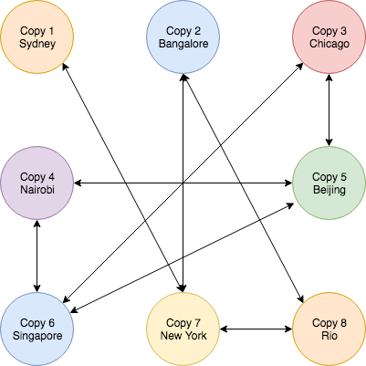
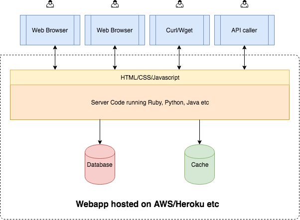
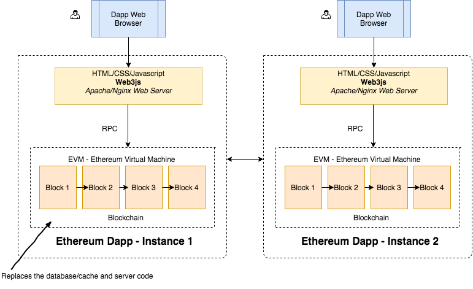
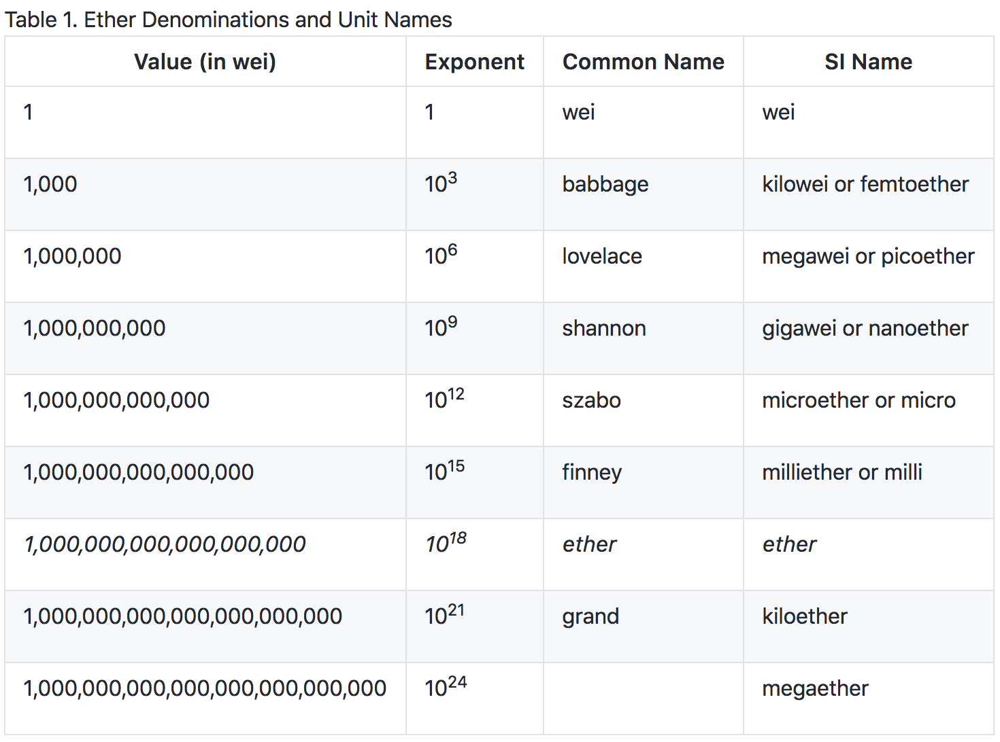

# **지불(Payment), 그 이상을 향해**

비트코인 블록체인은 주로 은행과 같은 중앙 기관의 중재 없이 블록체인의 다양한 당사자 간에 돈을 송금하는 데 사용됩니다. **비탈릭 부테린(Vitalik Buterin)**이라는 이름의 19세 청년 개발자는 이러한 탈중앙화의 개념을 송금 외에 다른 분야에 적용하고자 했습니다. 그는 중앙화된 통제 권한 없이 전 세계적으로 운영될 수 있는 응용 프로그램을 만들고 싶었습니다. 예를 들어, 페이스북의 경우 페이스북 주식회사가 사용자의 데이터를 소유하고 있으며 원하면 사용자의 계정을 제거할 수 있는 권리를 가집니다. 10년 뒤 페이스북이 폐쇄된다고 가정하면 모든 데이터가 손실될 수도 있습니다. 비탈릭은 응용 프로그램을 빌드할 수 있도록 비트코인에 스크립팅 언어를 추가할 것을 제안하지만 비트코인 개발팀과의 합의에 도달하지 못합니다. 결국 그는 2014년 1월에 일반적인 스크립팅 언어를 사용할 수 있는 새로운 플랫폼에 대한  [백서](https://github.com/ethereum/wiki/wiki/White-Paper) 를 출간합니다. 곧이어 개발팀이 꾸려지고, 개빈 우드(Gavin Wood) 박사의 팀이  [이더리움 황서](https://ethereum.github.io/yellowpaper/paper.pdf) 에서 네트워크의 모든 스마트 계약을 실행하는 런타임 환경인 EVM(EVerenum Virtual Machine)에 대해 설명했습니다(EVM 및 스마트 계약에 대한 자세한 내용은 다음 절에서 설명합니다). 이 플랫폼의 개발을 위한 자금의 크라우드펀딩은 2014년 7월부터 8월에 거쳐 이루어졌으며, 펀딩 참가자는 비트코인으로 이더리움 밸류 토큰(이더)을 구입했습니다.

# **세계의 컴퓨터**

이더리움은 퍼블릭 블록체인 기반의 분산 컴퓨팅 플랫폼입니다. 전세계의 수많은 작은 컴퓨터로 구성된 하나의 큰 컴퓨터로 생각할 수도 있습니다. 응용 프로그램을 작성하고이 글로벌 컴퓨터에서 실행할 수 있으며, 이 플랫폼은 중단 시간, 검열, 사기 또는 제 3 자의 간섭없이 항상 실행되도록 보장합니다. 응용 프로그램을 실행하는 것 외에도, 이더리움 블록체인을 통해 중앙 권한없이 두 당사자간에 돈을 이체할 수 있습니다. 이러한 모든 컴퓨터(노드라고도 함)는 서로 연결되어 있으며 **코드와 데이터의 전체 복사본**을 가지고 있습니다. 이더리움 블록체인에 코드를 배포하면 코드가 **네트워크의 모든 노드로 복제**됩니다. 응용 프로그램에 데이터가 저장되면 모든 노드에서 해당 **데이터가 복제**됩니다. 네트워크에는 수천 개의 노드가 있으며 모든 노드를 중지시키는 것은 거의 불가능합니다. 따라서 응용 프로그램에 항상 액세스할 수 있습니다.

# **웹앱 아키텍처**

이더리움을 이해하는 가장 좋은 방법 중 하나는 **기존의 클라이언트/서버 아키텍처**와 비교하는 것입니다. 웹 개발자라면 오른쪽 다이어그램을 쉽게 이해할 수 있을 것입니다(웹 아키텍처를 몰라도 괜찮습니다). 이것은 간단한 웹 애플리케이션의 클라이언트/서버 아키텍처입니다. 일반적인 웹 응용 프로그램은 일반적으로 **자바, C#, 루비, 파이썬**과 같은 프로그래밍 언어로 작성된 **서버 단 코드**로 구성됩니다. 프론트엔드 코드는 HTML/CSS/자바스크립트를 사용하여 구현됩니다. 전체 애플리케이션은 **AWS, 마이크로소프트 애져, 구글 클라우드 플랫폼, Heroku 또는 VPS**와 같은 호스팅 제공 업체에서 호스팅됩니다. 사용자는 웹 브라우저, curl/wget(커맨드 라인) 또는 API를 통해 클라이언트를 사용하여 웹 응용 프로그램과 상호 작용합니다. **중앙화된 하나의 웹 응용 프로그램이 있으며 모든 클라이언트가 이 응용 프로그램과 상호 작용**합니다. 클라이언트가 서버에 요청하면 서버는 요청을 처리하고 데이터베이스 또는 캐시와 상호 작용하며 데이터베이스를 읽고, 쓰고, 업데이트하고 클라이언트에 응답을 반환합니다.

다음 절에서는 이러한 기존의 구조와 이더리움 블록체인의 구조를 비교해 보겠습니다.

# **이더라움 아키텍처**

위 그림에서 알 수 있듯이, 모든 클라이언트(브라우저)는 응용 프로그램의 자체 인스턴스와 통신합니다. 모든 클라이언트가 연결할 중앙 서버가 없습니다. 즉, **이상적인 탈중앙화 세계**에서, Dapp(탈중앙화 애플리케이션)과 상호 작용하려는 모든 사람은 컴퓨터/스마트콘 등의 기기에 실행중인 블록체인의 전체 복사본이 필요합니다. 즉, 애플리케이션을 사용하려면 먼저 전체 블록체인을 다운로드한 다음 애플리케이션 사용을 시작해야 합니다. 우리가 사는 세계는 이상적인 세계가 아니기에, 모든 사람들이 이러한 앱을 사용하기 위해 블록체인 서버를 운영할 것으로 기대하는 것은 무리입니다. 하지만 탈중앙화의 배경은 단일/중앙화된 서버에 의존하지 않는 것입니다. 그래서 제안된 몇 가지 솔루션([블록체인 서버 호스팅 서비스](https://infura.io/), [Metamask](https://metamask.io/) 등)를 사용하면 하드 디스크와 RAM을 많이 사용하지 않아도 블록체인의 전체 복사본을 다운로드하고 실행하면서도 탈중앙화를 훼손하지 않을 수 있습니다. 앞으로의 이어지는 레슨에서 이러한 방식을 경험할 것입니다. 자, 그럼 이더리움 블록체인이 정확히 무엇일까요? 블록체인에는 2가지 구성 요소가 있습니다:

# **데이터베이스**

네트워크의 모든 트랜잭션은 블록체인에 저장됩니다. 응용 프로그램을 배포하는 행위도 트랜잭션으로 간주됩니다. 후보자 투표를 위한 투표 응용 프로그램을 예로 들면 하나하나의 투표가 트랜잭션로 간주됩니다. 이러한 모든 트랜잭션은 공개되며 누구나 볼 수 있고 확인할 수 있습니다. 이 데이터는 절대로 조작할 수 없습니다. 네트워크의 모든 노드에 동일한 데이터 복사본이 있는지 확인하고, 유효하지 않은 데이터가 이 데이터베이스에 기록되지 않도록 하기 위해 이더리움은 작업증명(Proof of Work)이라는 알고리즘을 사용하여 네트워크를 보호합니다.

# **코드**

블록체인의 데이터베이스 요소는 트랜잭션을 저장합니다. 그렇다면 투표 응용 프로그램에서 투표에 대한 모든 논리는 어디에 담길까요? 이더리움 세계에서는 솔리디티(Solidity)라는 언어로 논리/응용 프로그램 코드(스마트 계약)를 작성합니다. 그런 다음 솔리디티 컴파일러를 사용하여 이더리움 바이트코드(Ethereum Byte Code)로 컴파일한 다음 해당 바이트 코드를 블록체인에 배포합니다 (스마트 계약 작성에 사용할 수 있는 다른 언어가 조금 있긴 하지만, 가장 인기 있고 상대적으로 쉬운 것이 솔리디티). 따라서, 이더리움 블록체인은 트랜잭션을 저장할 뿐 아니라 스마트 계약 코드를 저장하고 실행합니다.

즉, 기본적으로 **블록체인은 데이터를 저장하고 코드를 저장하며 코드를 EVM (Ethereum Virtual Machine)에서 실행**합니다. 이후 이어지는 절에서 바이트코드 및 EVM에 대해 자세히 배울 예정입니다. 이더리움에는 웹 기반 Dapp을 만들기 위해 web3.js라는 편리한 자바스크립트 라이브러리가 있습니다. 이 라이브러리는 블록체인 노드에 연결됩니다. 따라서 react.js, angular.js 등의 유명한 js 프레임워크에 이 라이브러리를 포함시킬 수도 있습니다.

# **중요한 이더리움 관련 개념들**

## **스마트 컨트랙트(Smart Contracts)**

앞 절에서는 솔리디티 프로그래밍 언어로 응용 프로그램을 작성하고 이를 이더리움 블록체인에 배포하는 방법에 대해 설명했습니다. 이더리움에서는 이러한 응용 프로그램을 ‘스마트 계약’이라고 합니다. 왜 이러한 응용 프로그램을 스마트 계약이라고 부르는지 궁금하겠죠? 일반적으로 **계약은 법으로 집행되는 두 당사자, 또는 여러 당사자 간의 서면 합의**입니다. 계약서를 작성하여 코드로 변환하고 블록체인에 배포하면 디지털 계약이 체결됩니다. 블록체인에 있는 이 코드의 장점은 당사자 간의 합의를 강화할 수 있다는 점입니다. 이것이 바로 “스마트 계약”이라고 불리는 이유입니다. 이 코드가 어떻게 계약을 시행할 수 있을까요? 일단 계약이 블록체인에 배포되면 이를 중지하거나 수정할 수 없습니다. 이것이 계약이 시행되는 방식입니다. 이해를 위해 간단한 예를 살펴 보겠습니다.

- **Crowdsale 응용 프로그램**을 작성하려고 한다고 가정해 봅시다. 제품을 만들기 위해 10,000달러를 모으고자 하는 제작자가 있으며, 이 제품에 관심이 있고 선불로 기꺼이 지불할 잠재 고객이 있습니다. 계약상 각 고객이 보내는 액수가 $10 - $10,000 사이에 해당하면 수령할 것이고, **목표가 달성된다면 그 돈은 제작자에게 송금됩니다**. 그렇지 않은 경우, 기부자에게 돈이 돌려 보내집니다. 이는 스마트 계약을 사용하여 제작자와 지지자 간의 계약을 시행하는 이상적인 사용 사례입니다. 중앙화된 응용 프로그램에서도 이 논리를 구현하는 것은 간단합니다. 스마트 계약에서 이를 구현할 때의 장점은 아래와 같습니다.
  - 모든 참여자가 보낸 돈이 스마트 계약에 담겨 있습니다. 참여자도 제작자도 그 돈을 사용할 수 없습니다.
  - 목표에 도달하자마자 돈이 제작자에게 보내지도록 코드를 구현할 수 있습니다.
  - 특정시간 내에 목표에 도달하지 못하면 모든 참가자에게 환불을 시행할 수 있도록 코드를 구현할 수 있습니다.
  - 이 코드는 한번 블록체인에 배포된 후에는 조작할 수 없습니다.

## **이더, 그리고 이더의 단위**

각 국가마다 USD, INR, RNB, GBP, EUR 등과 같은 자체 통화가 있듯이, 각 블록체인에는 자체 통화가 있습니다. 이더리움 블록체인의 경우 기본 통화를 이더(Ether)라고 합니다. 이더를 USD 또는 EUR와 같은 다른 화폐로 교환할 수 있는 거래소도 있습니다. 이더의 현재 가격은  [이곳](https://onchainfx.com/asset/ethereum) 에서 확인할 수 있습니다.현실 세계의 통화에는 다양한 단위가 있습니다. 예를 들어 미국 1달러는 100센트이며 페니(1센트), 니켈(5센트), 십 센트(10센트), 쿼터(25센트)와 같은 다양한 단위가 있습니다. 국가 및 통화에 따라 다양한 단위가 있을 수 있습니다. **이더에도 아래 그림과 같이 다양한 단위 있습니다. 그 중에서 두 가지, 이더와 웨이만 잘 기억해도 됩니다. 웨이는 가장 낮은 단위로, 스마트 계약서에서 실제로 쓰이는 단위입니다.**

## **주소(Addresses)**

페이스북과 같은 웹사이트에 로그인하려면 일반적으로 이메일, 사용자 이름과 비밀번호를 사용합니다. 당신의 사용자 이름은 페이스북에서 신분증에 준하며, 사용자 이름 / 암호를 사용하여 페이스북 로그인을 위한 인증을 거치게 됩니다.이더리움 블록체인에서 사용자의 신분증에 해당하는 것은 주소입니다. 이더리움 주소는 001d3f1ef827552ae1114027bd3ecf1f086ba0f9과 같은 형태를 가집니다. 각 주소에는 해당 개인키가 있습니다. 개인키는 사용자가 알고 있는 일종의 암호로 간주할 수 있습니다. 블록체인과 상호 작용하려면 이 주소 + 개인키 쌍이 필요합니다. 다음은 블록체인과 이더리움을 이해하기 위해 암기해야 할 몇 가지 핵심 사항입니다.

- 이더리움 주소는 공개되어 있으며 전 세계 누구와도 공유 할 수 있습니다.
- 개인키는 절대 다른 사람과 공유해서는 안됩니다.
- 주소 + 개인키는 그 어떤 데이터베이스에도 저장되지 않습니다. 사용자만이 이 정보를 통제 할 수 있습니다.

### **이더리움 주소는 어떻게 생성되는가?**

아래의 예는 001d3f1ef827552ae1114027bd3ecf1f086ba0f9 라는 주소가 어떻게 생성되는지에 대한 간단한 설명입니다. 공개키 암호화의 원리를 알고 있다는 가정 하에 작성된 내용이며, 자세한 내용은 다음 링크를 참조하십시오.

1. 개인키 생성
   1. k(private key) = f8f8a2f43c8376ccb0871305060d7b27b0554d2cc72bccf41b2705608452f315
2. 개인키로부터 공개키 생성
   1. K(public key) = 6e145ccef1033dea239875dd00dfb4fee6e3348b84985c92f103444683bae07b83b5c38e5e2b0c8529d7fa3f64d46daa1ece2d9ac14cab9477d042c84c32ccd0
3. keccak256 알고리즘으로 공개키의 해시값 계산
   1. Keccak256(K) = 2a5bc342ed616b5ba5732269001d3f1ef827552ae1114027bd3ecf1f086ba0f9001d3f1ef827552ae1114027bd3ecf1f086ba0f9
4. 생성된 해시갑의 뒤쪽 20바이트를 취하여 이더리움 주소 생성
   1. 0x001d3f1ef827552ae1114027bd3ecf1f086ba0f9

## **계정(Accounts)**

이더리움 주소와 개인키의 조합을 **계정(account)**이라고 합니다. 이더리움 계정은 이더 잔고를 보유하고 트랜잭션을 전송할 수 있으며, 2가지 유형이 있습니다.

1. 외부 소유 계정(EOA)위에서 언급한, 공개 주소와 개인키의 조합을 말합니다. 외부 소유 계정, 또는 외부 계정을 사용하면,
   1. 다른 계정과 이더를 송수신하고
   2. 스마트 컨트랙트에 트랜잭션을 보낼 수 있습니다.
2. 컨트랙트 계정컨트랙트 계정에는 **상응하는 개인키가 없습니다**. 이러한 계정은 스마트 계약을 블록체인에 배포할 때 생성됩니다. 컨트랙트 계정 대신 컨트랙트(contract)로만 표시되기도 합니다. 컨트랙트(계정)의 몇 가지 주요 기능은 다음과 같습니다.
   1. 다른 계정과 이더를 송수신하고(EOA와 동일)
   2. 관련된 코드를 담고(EOA와 다름)
   3. EOA나 다른 컨트랙트의 호출을 받아 트랜잭션을 발생시킵니다.

## **지갑(Wallets)**

지갑은 이더리움 계정을 저장하고 관리하는 데 사용되는 소프트웨어 플러그인 또는 라이브러리입니다. 지갑을 통해 여러 계정을 관리하고, 트랜잭션에 서명하고, 잔고을 추적하는 등의 기능을 사용할 수 있습니다. 지갑은 크게 2 가지 유형으로 분류할 수 있습니다.

- 비결정적 지갑: 이것은 임의의 개인키/공개키 쌍을 사용하는 유형의 지갑입니다. 개인키/공개키 쌍을 많이 생성할 수 있지만 각 키 쌍 간에는 아무런 상관 관계가 없습니다.
- 결정론적 지갑: 이 유형의 지갑에서는 모든 키가 시드(seed)라는 단일 시작 지점에서 파생됩니다. 이 시드는 사용자가 다른 정보를 요구하지 않고 **지갑을 쉽게 백업하고 복원**할 수 있게 해주며, 경우에 따라 **개인키를 모른 채 공개키를 생성**할 수 있게 해 줍니다. 시드는 일반적으로 사람이 읽을 수 있는 니모닉 문구 단어로 배열됩니다. 메타마스크(metamask)와 같은 플러그인을 사용한다면 처음 설치했을 때 12개 단어로 이루어진 시드를 저장하라는 요청을 받았을 것입니다.

## **가스, 가스 가격, 가스 한도**

### **가스(Gas)**

이더리움 블록체인에 스마트 계약을 배포하고 트랜잭션을 실행하기 위해서는 각 상호 작용과 관련된 비용이 소모됩니다. 블록체인에서 트랜잭션을 실행하려면 네트워크의 채굴자에게 이더를 지불해야 합니다.

그럼 트랜잭션을 위해 지불하는 이더의 양은 누가 결정할까요? 이는 이더리움에 익숙하지 않은 많은 개발자들이 혼란스러워하는 부분이기도 합니다. 여기에 대한 답은 이더리움 황서에 기재되어 있는데, 트랜잭션에 얼마나 많은 ‘단위 연산’이 포함되는지에 따라 달라집니다. 예를 들어 트랜잭션이 단순히 두 개의 숫자를 더하는 작업이라면 이는 3개의 단위 연산에 해당합니다. 곱셈이라면 5개의 단위 연산에 해당합니다. 이러한 연산의 단위를 가스(Gas)라고 합니다.

### **가스 가격(Gas Price)**

각 트랜잭션이 얼마나 많은 가스를 필요로 하는지 알아도, 실제로 채굴자에게 지불해야 하는 이더의 양은 아직 알 수 없습니다. 이것을 결정하는 요소가 **가스 가격(Gas price)**입니다. 재미있는 점은, 트랜잭션 생성자가 원하는 가스 가격을 설정할 수 있다는 점입니다. 예를 들어,**’가스당 3Gwei를 지불할 용의가 있습니다’**라고 설정하는 식입니다. 당신의 트랜잭션이 100000가스를 소비하고 가스 가격을 3Gwei로 설정하면, 해당 트랜잭션에 대한 수수료로 3000000Gwei를 지불하게 됩니다.

설정한 가스 가격이 높을수록 트랜잭션이 더 빨리 처리됩니다. 이는 대부분의 채굴자들이 가스 가격의 내림차순으로 트랜잭션을 분류하고 가스 가격이 높은 트랜잭션을 선택하여 블록에 포함시키기 때문입니다. 가격을 낮게 책정해도 결국 트랜잭션이 블록에 포함되기는 하겠지만, 그 대기 시간이 상당히 길어질 수 있습니다.

### **가스 한도(Gas Limit)**

트랜잭션이 소모하는 가스의 양을 정확하게 파악하는 것은 매우 어렵습니다. 사용자 입장에서는 아무 생각 없이 트랜잭션을 전송했다가 수백 달러 어치의 이더를 수수료로 소모하고 싶지는 않을 겁니다. 사용자는 이 상황을 피하기 위해, 트랜잭션을 실행하기 위해 사용할 가스의 최대 금액을 나타내는 **가스 한도(Gas Limit)**를 지정할 수 있습니다.

**가스 한도를 블록 가스 한도(Block Gas Limit)과 혼동하면 안 됩니다.** 블록 가스 한도는 이더리움의 각 블록에 적용되는 최대 캡입니다. 현재 이더리움의 블록은 가스 총액이 800만 이내의 범위에서만 트랜잭션을 포함할 수 있습니다. 각 블록에 대해 가스 제한이 있는 이유는, 누군가가 무한 루프를 실행할 수 없도록 하기 위함입니다. 무한 루프가 발생하면 트랜잭션 실행이 완료되지 않아 블록 채굴이 발생하지 않기 때문입니다.

## 바이트코드

스마트 계약 코드는 대개 **솔리디티(Solidity)**와 같은 고급 프로그래밍 언어로 작성됩니다. 이 코드는 이더리움 블록체인에 배포되는 **EVM 바이트코드** 로 컴파일됩니다. 이것은 코드가 JVM 바이트코드로 변환되는 자바 등의 프로그래밍 언어와 매우 유사합니다. 이더리움의 런타임 환경은 바이트코드만을 이해하고 실행할 수 있습니다. 이러한 설계의 이점 중 하나는 개발자가 다른 프로그래밍 언어를 사용하여 스마트 계약을 구현할 수 있는 옵션을 제공한다는 점입니다. 현재 파이썬과 유사한 **바이퍼(Vyper)** 등 몇몇 언어가 EVM 바이트코드로 컴파일됩니다. 프로그램 언어 설계자 입장에서는 이더리움 황서를 참조하여 독자적인 이더리움 프로그래밍 언어를 구현할 수도 있습니다!

## EVM(Ethereum Virtual Machine)

이더리움 가상 머신(Ethereum Virtual Machine, EVM)은 단순하지만 강력한, 튜링 완전성을 가진 256비트 가상 머신으로써 누구나 임의의 EVM 바이트코드를 실행할 수 있습니다. EVM은 이더리움 프로토콜의 일부이며, 이더리움 시스템의 합의 엔진에서 중요한 역할을 합니다. EVM은 누구나 신뢰가 필요없는 환경에서 임의의 코드를 실행하고, 그 결과로 완전히 결정론적이고 실행 결과가 보장됩니다. geth, parity 등의 이더리움 클라이언트를 설치하고 실행하면 EVM이 시작되고, EVM이 트랜잭션의 동기화, 유효성 검사 및 실행을 시작합니다.

# 알고 있어야 할 개발 도구들

## Geth

Geth는 이더리움 재단([Ethereum Foundation](http://ethereum.org/))이 제공하는 공식 클라이언트 소프트웨어로써, Go언어로 개발되었습니다. Geth를 처음 시작하면 네트워크 내의 다른 이더리움 클라이언트(노드node라고도 불림)에 연결하는 작업을 먼저 시작하고 블록체인의 전체 사본을 내려받게 됩니다. Geth는 **블록체인의 복사본을 최신 상태로 유지**

하기 위해 끊임없이 다른 노드와 통신합니다. 또한 **블록을 채굴** 하고, 블록체인에 트랜잭션을 추가하고 블록의

**트랜잭션을 검증**하며 **트랜잭션을 실행** 할 수도 있습니다. 그리고 RPC를 통해 상호작용할 수 있는 API를 노출하여 서버 역할을 하기도 합니다. 블록체인에 연결할 수 있는 **자바스크립트 클라이언트** (geth console)도 있습니다.

## 패리티

패리티(Parity)는 이더리움 프로토콜의 또 다른 구현체이며, 러스트(Rust) 프로그래밍 언어로 개발되었습니다. 현재 Parity Inc. 라는 기업에서 운영하고 있습니다. 사실 이더리움 네트워크에 접속할 수 있는 클라이언트 소프트웨어를 개발하는 길은 누구에게나 열려 있으며, C++, 파이썬 및 다른 언어로 작성된 클라이언트도 있습니다. 원한다면 이더리움 황서의 사양을 따라 자신의 클라이언트를 구현할 수도 있습니다!

## Web3.js

web3js는 이더리움 블록체인과 상호작용하는 데 사용되는 유명한 자바스크립트 라이브러리입니다. 이 자바스크립트 라이브러리를 사용하면 모든 프론트엔드 프레임워크에서 사용자가 탈중앙화 애플리케이션을 이용하게 할 수 있습니다. [이 예제](https://www.zastrin.com/simple-ethereum-voting-dapp.html) 는 web3.js를 사용하여 만든 데모, 투표 애플리케이션입니다. 블록체인과 상호작용하는 또 다른 라이브러리로 [Ethers.js](https://github.com/ethers-io/ethers.js/)도 있습니다.

## 트러플(Truffle)

Ruby on Rails, Django 등과 같은 웹 애플리케이션 개발을 위한 프레임워크처럼, 트러플은 dapps 개발에 가장 널리 사용되는 프레임워크 중 하나로써 블록체인에서 스마트 계약을 컴파일하고 배포하는 복잡성을 많이 추상화합니다. 트러플 프레임워크에 대한 자세한 내용은 [http://truffleframework.com/](http://truffleframework.com/) 에서 확인할 수 있습니다.

**본 강좌의 모든 과정도 트러플 프레임워크를 기반으로 합니다.** 트러플의 대안으로 [Embark](https://github.com/embark-framework/embark)라는 프레임워크도 있습니다.

## 가나슈(Ganache)

개발을 위해 geth 또는 패리티 같은 클라이언트를 사용하면 각 트랜잭션을 실행하는 데 15 초씩 걸리기 때문에 개발 속도가 느려질 수 있습니다. 이 문제를 해결하기 위해 일반적으로 개발 목적으로 [가나슈(ganache)](http://truffleframework.com/ganache/)라는 메모리 내 블록체인을 사용할 수 있습니다. ganache-cli 또는 GUI 버전의 커맨드 라인 버전을 설치할 수 있습니다. 가나슈의 또 다른 장점은 테스트를 위해 100개의 이더가 미리 탑재된 10개의 테스트 계정을 확보하게 된다는 점입니다.

## 메타마스크(Metamask)

앞 장에서 지갑에 대해 설명했습니다. 이더리움 지갑 중 메타마스크는 커뮤니티에서 사용되는 가장 인기있는 지갑 중 하나입니다. 메[타마스크 웹사이트](https://www.metamask.io/)에서 크롬 플러그인으로 설치할 수 있습니다. 아래에서 메타마스크를 설치하는 방법과 결정론적 지갑의 개념, 시드 문구의 개념을 보여주는 비디오를 확인할 수 있습니다.

## 이더스캔(Etherscan)

[이더스캔(Etherscan)](https://etherscan.io/)은 이더스캔 사에서 서비스하는 무료 프론트엔드 애플리케이션으로, 이더리움 블록체인을 위한 편리한 탐색기입니다. 퍼블릭 이더리움 블록체인의 모든 주소, 트랜잭션과 블록에 대한 정보를 이 웹사이트에서 확인할 수 있습니다. 오른쪽 그림은 이더리움 네트워크를 시각화한 것으로 네트워크 내에서 이더스캔의 위치를 볼 수 있습니다. 다양한 퍼블릭 네트워크에 대해 대응되는 각각의 이더스캔 페이지가 있으며, 링크는 아래와 같습니다.

## 리믹스(Remix)

리믹스는 스마트 계약을 코딩하는 데 사용할 수 있는 브라우저 IDE입니다. 편집기로 사용할 수 있을 뿐 아니라, IDE로 직접 다양한 네트워크에 스마트 계약을 컴파일하고, 배포하고 상호작용할 수 있습니다. 또한 다양한 컴파일러 버전을 선택하고, 스마트 계약을 디버깅하는 등 많은 기능을 제공합니다. [https://remix.ethereum.org](https://remix.ethereum.org/)에서 IDE에 접근할 수 있습니다. 리믹스는 소규모 스마트 계약을 신속하게 테스트하기에 좋지만, 전문적인 스마트 계약 개발을 위해서는 **Vim, Atom, Visual Studio 또는 Sublime**과 같은 편집기를 개발용으로 사용하고 스마트 계약의 컴파일 및 배포에는 트러플 프레임워크를 사용할 것을 권장합니다.

---

[1] 인프런, [무료 이더리움 입문 바이블: 모든 이더리움 입문자를 위하여](https://www.inflearn.com/course/ethereum-bible)
