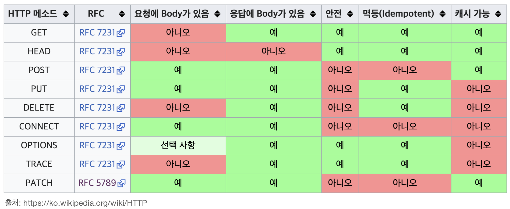
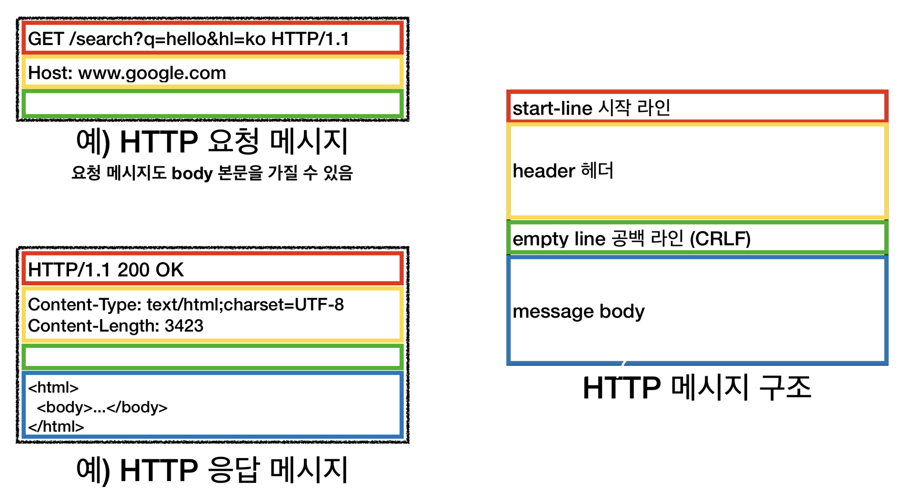
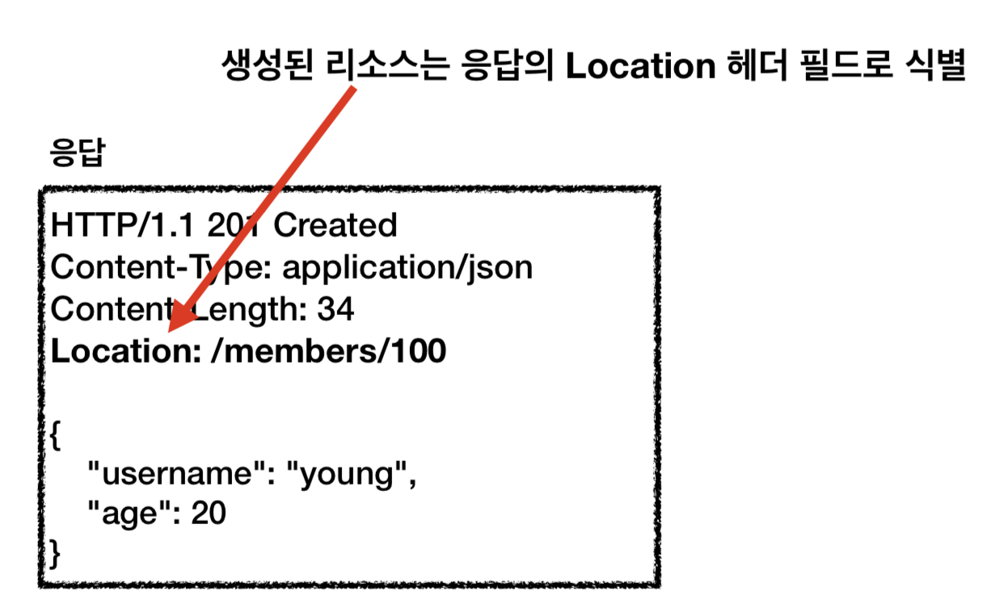
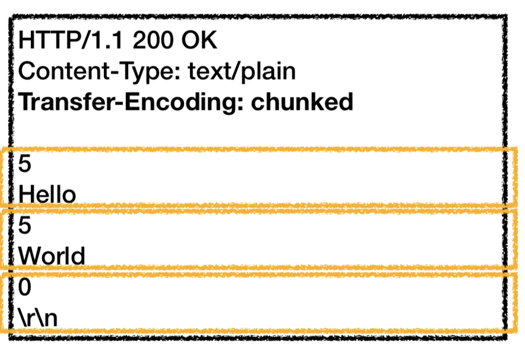
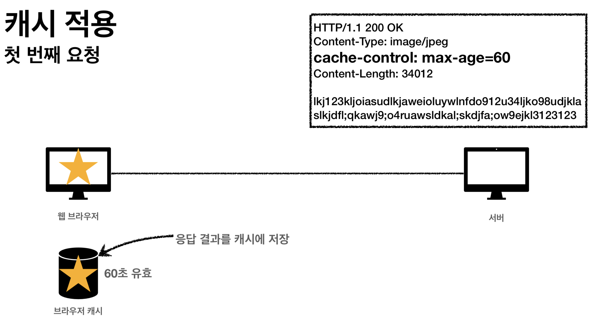
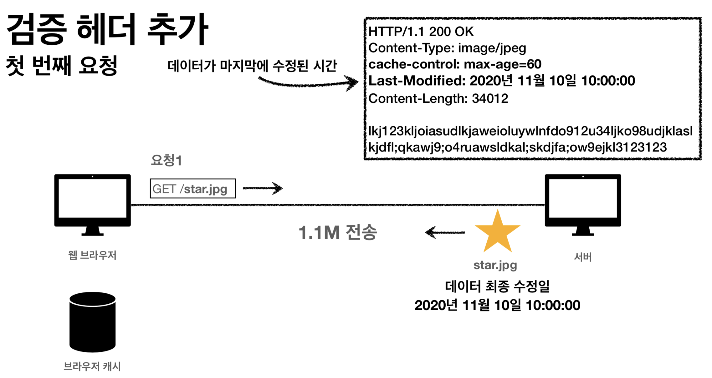
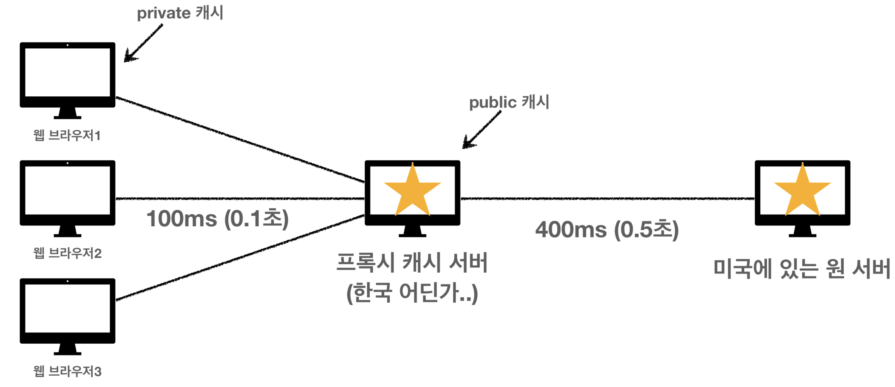
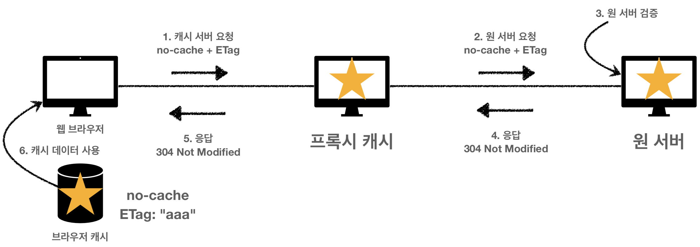
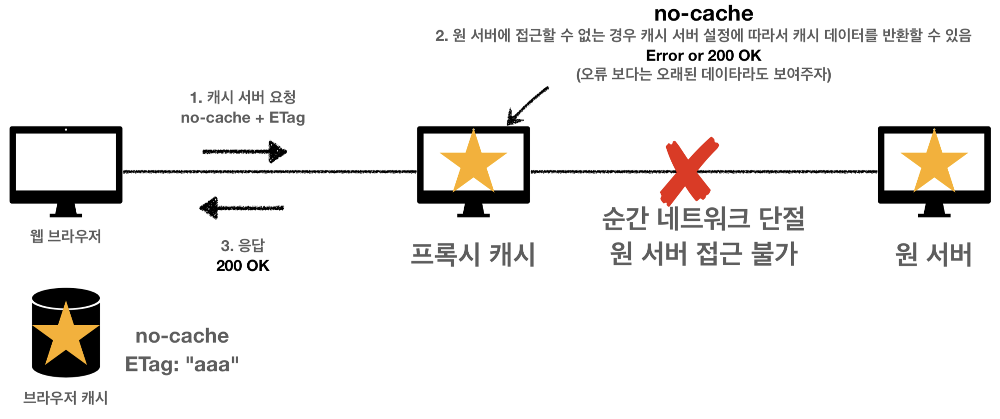
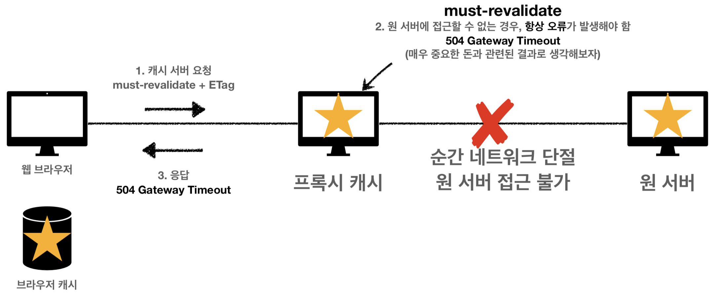

# HTTP

하이퍼텍스트 전송 프로토콜(HTTP)은 HTML과 같은 하이퍼미디어 문서를 전송하기위한 애플리케이션 레이어 프로토콜이다. 웹 브라우저와 웹 서버간의 커뮤니케이션을 위해 디자인되었지만 **다른 목적으로도 사용될 수 있다**. HTTP는 클라이언트가 요청을 생성하기 위한 연결을 연 다음 응답을 받을 때까지 대기하는 **전통적인 클라이언트-서버 모델**을 따릅니다. HTTP는 `무상태 프로토콜`이며 이는 서버가 두 **요청간에 어떠한 데이터(상태)도 유지하지 않음**을 의미한다.

## HTTP 가이드

HTTP는 애플리케이션 계층의 프로토콜로 신뢰 가능한 전송 프로토콜이라면 이론상으로는 무엇이든 사용할 수 있으나 TCP 혹은 암호화된 TCP 연결인 TLS를 통해 전송된다.

- HTTP는 사람이 읽을 수 있으며 간단하게 고안되었다.
- HTTP 헤더는 HTTP를 확장하고 실험하기 쉽게 만들어줬다.
- HTTP는 상태가 없지만, 세션은 있다.
- 연결은 전송 계층에서 제어되므로 근본적으로 HTTP 영역 밖이다. 따라서 HTTP는 전송 프로토콜을 요구하지 않는다.

### HTTP로 제어할 수 있는 것

- 캐시
- origin 제약사항을 완화하기(CORS 관련)
- 인증: HTTP 헤더의 `WWW-Authenticate` 혹은 Cookie
- 프록시와 터널링
- 세션

### 요청(Request)의 구성

- HTTP 메서드: GET, POST, OPTIONS, HEAD 등등
- 가져오려는 리소스의 경로
- HTTP 프로토콜의 버전
- 서버에 대한 추가 정보를 전달하는 선택적 헤더들
- POST와 같은 몇 가지 메서드를 위한 본문

<aside>
💡 From: 유저 에이전트의 이메일 정보
Referer: 이전 웹 페이지 주소
User-Agent: 유저 에이전트 애플리케이션 정보 (어떤 종류의 브라우저에서 장애가 발생하는지 파악가능)
Server: 요청을 처리하는 오리진 서버의 소프트웨어 정보 Date: 메시지가 생성된 날짜
Host: 요청한 호스트 정보(도메인) - 필수
Location: 페이지 리다이렉션(201의 경우에는 생성된 URI)
Allow: 허용 가능한 HTTP 메서드
Retry-After: 유저 에이전트가 다음 요청을 하기까지 기다려야 하는 시간
Authorization: 클라이언트 인증 정보를 서버에 전달
WWW-Authenticate: 리소스 접근시 필요한 인증 방법

</aside>

### HTTP 메소드의 속성

- `안전(Safe Methods)`: 호출해도 리소스를 변경하지 않는다.
- `멱등(Idempotent Methods)`: **f(f(x)) = f(x)**한 경우이다. 자동복구 메커니즘, 서버가 타임아웃 등으로 정상 응답을 못주었을 때, 클라이언트가 같은 요청을 다시 해도 되는가 같은 판단 근거가 된다.
- `캐시 가능(Cacheable Methods)`: 응답결과 리소스를 캐시해서 사용해도 되는가?



### 응답(Response)의 구성

- HTTP 프로토콜의 버전
- 요청의 성공 여부와 그 이유를 나타내는 상태 코드
- 아무런 영향력이 없는, 상태 코드의 짧은 설명을 나타내는 상태 메시지
- 요청 헤더와 비슷한 HTTP 헤더들
- (선택사항으로) 가져온 리소스가 포함되는 본문

(노란색 부분인 헤더 부분에는 임의의 헤더가 추가 가능하다. 예를 들어 hello: world 이런식의 임의의 데이터도 가능하다는 것이다)



## Status Code

<aside>
💡 1XX (Informational): 요청이 수신되어 처리중
2XX (Successful): 요청 정상 처리
3XX (Redirection): 요청을 완료하려면 추가 행동이 필요
4XX (Client Error): 클라이언트 오류, 잘못된 문법등으로 서버가 요청을 수행할 수 없음
5XX (Server Error): 서버 오류, 서버가 정상 요청을 처리하지 못함

</aside>

만약 브라우저가 모르는 상태 코드가 나타나도 상위 상태코드(앞 자리)로 해석하여 처리함으로써 확장성을 가질 수 있게 되었다.

- `201 Created`: 생성된 리소스의 Location을 응답으로 주며, 보통 생성된 리소스의 본문도 포함해준다.



- `202 Accepted`: 요청이 접속되었으나 처리가 완료되지 않았음을 의미한다. 배치 처리 같은 곳에서 사용한다. 예를 들어 요청 접수 후 1시간 뒤에 배치 프로세스가 요청을 처리하는 경우를 들 수 있다.
- `204 No Content`: 예를 들어 웹 문서 편집기의 세이브 버튼의 경우 결과 내용없이도 성공을 인식할 수 있다.
- `301 Moved Permanently`: 리다이렉트시 요청 메서드가 `GET`으로 변하고 본문이 제거될 **수도** 있다.
- `308 Permanent Redirect`: 301과 기능은 같지만 메소드와 본문이 유지된다.
- `302 Found`: 301처럼 메서드가 GET으로 변하거나 본문 제거가 가능하다,.
- `307 Temporary Redirect`: 308처럼 메소드와 본문이 유지된다.
- `303 See Other`: 302와 같지만 메서드가 `GET`으로 변한다.
- **PRG(Post/Redirect/Get)**
  - 포스트로 주문 후에 웹 브라우저를 새로고침하면? 새로고침은 다시 요청이므로 중복주문이 가능하다.
  - PRG를 이용한 일시적인 리다이렉션
    - POST로 주문 후에 주문 결과 화면을 GET메소드로 리다이렉트한다.
    - 이렇게 하는 경우 새로고침해도 GET으로 조회될 뿐이다.
- `300 Multiple Choices`: 안쓴다
- `304 Not Modified`: 캐시를 목적으로 사용한다. 클라이언트에게 리소스가 수정되지 않았음을 알려준다. 따라서 클라이언트는 로컬 피씨에 저장된 캐시를 재사용(리다이렉트)한다. 304는 응답에 메시지 바디를 포함하면 안된다.
- `400 Bad Request`: 클라이언트의 잘못된 요청(파라미터나 에이피아이 스펙에 안맞을때)
- `401 Unauthorized`: 응답에 WWW-Authenticate 헤더와 함께 인증방법을 설명해야 한다.
- `403 Forbidden`: 인증은 됐지만 인가가 되지 않은 경우
- `503 Service Unavailable`: 서비스 이용불가를 뜻한다. Retry-After 헤더 필드로 얼마 뒤에 복귀되는지를 사용자에게 알릴 수도 있다.

## 리소스와 URIs

### URI(Uniform Resource Identifier)

- URL(Uniform Resource Locator): [https://developer.mozilla.org/en-US/docs/Learn/](https://developer.mozilla.org/en-US/docs/Learn/)
- URN(Uniform Resource Name): 특정 네임스페이스에서 이름으로 리소스를 식별하는 URI이다. urn:isbn:9780141036144

### URI 구문

- 스키마 또는 프로토콜: 브라우저가 사용해야 하는 프로토콜을 나타낸다. FTP의 경우 점점 많은 브라우저에서 보안상의 이유로 지원을 중단하고 있다.
  http://[www.example.com:80/path](http://www.example.com/path)
- 도메인 이름: 요청중인 웹 서버를 나타내며, IP주소를 직접 사용하는 것도 가능하지만 자주 사용되지 않는다.
  [http://`www.example.com`:80/path](http://%60www.example.com%60/path)
- 포트: 웹 서버의 리소스에 액세스하는데 사용되는 기술적인 **게이트**를 타나낸다. HTTP의 경우 80, HTTPS의 경우 443 등 표준 포트의 경우 일반적으로 포트가 생략된다.
  [http://www.example.com](http://www.example.com/)`:80`/path
- 경로: 웹 서버의 리소스 경로로, 초기 웹에서는 물리적 파일 위치를 나타냈지만 요즘에는 웹 서버에 처리를 요청하는 것에 가깝다.
  [http://www.example.com:80](http://www.example.com/)`/path`
- 쿼리: 웹 서버에 제공되는 추가 매개변수이다.
  [http://www.example.com:80/path`?key1=value1&key2=value2`](http://www.example.com/path%60?key1=value1&key2=value2%60)
- 프레그먼트(Fragement): 리소스 자체의 다른 부분에 대한 앵커이다. 일종의 북마크를 나타내며 브라우저는 앵커의 정의된 지점으로 스크롤된다. 비디오나 오디오 문서에서는 앵커가 정의된 시간으로 이동하려고 시도한다. `프레그먼트 식별자`라고 하는 # 뒤의 부분은 요청과 함께 서버로 전송되지 않는다.
  [http://www.example.com:80/path`#SomewhereInTheDocument`](http://www.example.com/path%60#SomewhereInTheDocument%60)
- www와 non-www: 여러 기술들에 의해 웹 서버는 www가 접두화된 도메인과 그렇지 않은 도메인 모두에 정확하게 응답할 수 있다.

### MIME 타입

`MIME 타입`이란 클라이언트에게 전송된 문서의 다양성을 알려주기 위한 메커니즘이다. 웹에서 파일의 확장자는 별 의미가 없다. 그러므로 각 문서와 함께 올바른 MIME 타입을 전송하도록, 서버가 정확하게 설정하는 것이 중요하다. MIME 타입이 없거나 클라이언트가 타입이 잘못 설정됐다고 판단한 경우에 브라우저들은 `MIME 스니핑`을 시도할 수 있는데 이는 리소스를 훑어보고 정확한 타입을 유추해내는 것이다.

- text/plain
- text/html
- image/jpeg
- image/png
- audio/mpeg
- audio/\*
- video/mp4
- application/octet-stream -> 모든 종류의 이진 데이터를 나타낸다.
- multipart/form-data
- …

### 파일업로드

- Content-Type: multipart/form-data

```
POST /save HTTP/1.1
Host: localhost:8080
Content-Type: multipart/form-data; boundary=——-XXX

——-XXX
Content-Disposition: form-data; name=“username”

——-XXX
Content-Disposition: form-data; name=“file1”; filename=“intro.png”
Content-Type: image/png

1092342abddd21342348989234…
——-XXX—
```

## HTTP의 진화

### 월드 와이드 웹의 발명

1989년 제네바의 CERN에서 일하고 있던 Tim Berners-Lee에 의한 인터넷 상의 하이퍼텍스트 시스템 제안. HTML, HTTP, 월드 와이드 웹이라고 불리는 첫번째 브라우저, 문서에 접근하도록 해주는 httpd의 초기 버전으로 구성되었다.


### HTTP/0.9(원라인 프로토콜)

HTTP 초기 버전에는 버전 번호가 없었다. HTTP/0.9는 차후 버전과 구별하기 위해 0.9로 불리게 되었다. HTTP/0.9는 단일라인으로 극히 단순하다. HTTP 헤더가 없으며 리소스에 대한 경로와 GET 메서드가 유일했다. 응답 역시 파일 내용 자체로만 구성되었다.

```
GET /mypage.html
```

### HTTP/1.0

- RFC 1945 문서에 의해 공개되었다.
- 버전 정보가 요청마다 전성되기 시작했다.
- 상태 코드가 응답에 포함되어 성공과 실패를 알 수 있고 결과에 따른 동작을 수행할 수 있게 되었다.
- HTTP 헤더가 추가되어 메타데이터 전송을 허용하고 프로토콜을 유연하고 확장가능하게 만들어 주었다.
- 헤더의 도움으로 Plain HTML 외의 다른 문서들을 전송하는 기능이 추가되었다.

### HTTP/1.1

- RFC 2068 문서에 의해 공개되었다.
- 커넥션이 재사용될 수 있게 하여 성능이 개선되었다. `Persistent Connection`
- 파이프라이닝을 추가하여 첫 번째 요청에 대한 응답이 완전히 전성되기 이전에 두 번째 요청 전송이 가능해졌다. 이는 레이턴시를 낮췄다. (요청을 큐잉했다가 커넥션이 한번 열릴때 같이 처리하는 개념이다. 종종 병목의 원인이 되기도 한다.)
- Chunk된 응답이 지원되었다.
- 추가적인 캐시 제어 메커니즘이 도입되었다.
- 컨텐츠 네고시에이션이 도입되었다.



HTTP/1.1은 극도의 안정성을 유지해왔고 확장성이 있었기 때문에 따라서 15년이나 유지되었다. 그 와중에도 발생했던 큰 변화들은 아래와 같다.

- HTTPS가 도입되었다.
- REST(Representational state transfer) 패턴이 고안되었다.

<aside>
💡 **DEVIEW 2017 - 그런 REST API로 괜찮은가?**
HATEOAS(애플리케이션의 상태는 Hyperlink를 이용해 전이되어야 한다)

</aside>

[https://youtu.be/RP_f5dMoHFc](https://youtu.be/RP_f5dMoHFc)

### HTTP/2

2010년 전반기 Google은 실험적인 `SPDY 프로토콜`을 구현하여, 클라이언트와 서버 간의 데이터 교환을 대체할 수단을 실증하였다. SPDY는 HTTP/2 프로토콜의 기초로써 기여했다. HTTP/2 프로토콜은 HTTP/1.1과 몇가지 근본적인 차이점를 가지고 있다.

- 텍스트 프로토콜이라기보다는 이진 프로토콜이다. 더 이상 읽을 수 없고 수작업이 불가능해졌다. 이런 결점의 보상으로 최적화 기술이 구현가능해졌다.
- 병렬 요청이 동일한 커넥션 상에서 다뤄질 수 있는 다중화 프로토콜로, 순서를 제거해주고 HTTP/1.x 프로토콜의 제약사항을 막아준다. `Multiflexing`
- 전송된 데이터의 분명한 중복과 불필요한 오버헤드를 제거하면서 연속된 요청 사이의 매우 유사한 내용으로 존재하는 헤더들을 압축한다.
- 서버로 하여금 사전에 클라이언트 캐시를 `서버 푸쉬`라고 불리는 매커니즘에 의해 필요하게 될 데이터로 채워넣도록 허용한다. 예를 들어 기존의 방식은 HTML 요청, 요소 파싱, 리소스 재요청 등의 단계가 나눠져 있었다면 서버 푸쉬에 의해 한번에 요청이 가능해진 것이다.
- 헤더의 합축이 hpack 방식으로 개선되었다.

### HTTP/3

HTTP의 다음 메이저 버전인 HTTP/3에서는 전송 계층 부분에 TCP/TLS 대신 `QUIC`가 사용된다. Reliable UDP가 활용되었다.

## HTTP/1.x의 커넥션 관리

커넥션 관리는 HTTP의 주요 주제이다. 대규모로 커넥션을 열고 유지하는 것은 웹 사이트 혹은 웹 어플리케이션의 성능에 많은 영향을 준다. HTTP/1.x에는 몇 가지 모델이 존재한다.

### 단기 커넥션

각각의 HTTP 요청은 각각의 커넥션 상에서 실행된다. 이는 TCP 핸드 셰이크는 각 HTTP 요청 전에 발생하고 이들이 직렬화됨을 의미한다.

### 영속적인 커넥션

영속적인 커넥션의 컨셉은 `keep-alive 커넥션`이라고 불리기도 한다. 이는 얼마간 연결을 열어놓고 여러 요청에 재사용함으로써, 새로운 TCP 핸드셰이크를 하는 비용을 아끼고 성능 향상을 기대할 수 있다. 하지만 이는 유휴 상태에도 서버 리소스를 소비하는 단점이 있으며 이에 따라 DDoS 공격의 원인이 되기도 한다.

### HTTP 파이프라이닝

파이프라이닝이란 같은 영속적인 커넥션을 통해서, 응답을 기다리지 않고 요청을 연속적으로 보내는 기능이다. 이것은 커넥션의 지연을 회피하고자 하는 방법이다. 이론적으로는 두 개의 HTTP 요청을 하나의 TCP 메시지 안에 채워서 성능을 더 향상시킬 수 있다. 하지만 모던 브라우저들은 기본적으로 이 기능을 비활성화 상태로 두는데 이는 예상하기 어렵고 오류를 많이 야기하기 때문이다. 이런 이유들로 파이프라이닝은 멀티플렉싱 알고리즘으로 대체되고 HTTP/2에서 활용되었다.

### 도메인 샤딩

예를 들어 www.example.com이라는 하나의 도메인에서 모든 리소스를 가져오는 대신 [www1.example.com](http://www1.example.com/), [www2.example.com](http://www2.example.com/), …과 같이 여러 개의 분할된 도메인에서 커넥션을 맺고 리소스를 가져오는 방식이다. 다만 이 기술은 deprecated되었다. HTTP/2로 전환하여 사용하는 것이 권장된다.

# HTTP 캐싱



데이터가 수정되지 않아야 클라이언트가 캐시를 쓸텐데 어떻게 알 수 있을까? => `Last-Modefied`



마지막 수정시간을 보내고, 서버는 저 시간대로 확인해서 수정이 없었다면 스테이터스 코드에서 설명한거처럼 304에 빈 바디로 응답을 준다. 그러면 캐시를 사용하면 된다. 캐시를 사용한다면 **헤더만 다운받으면** 되므로 효율적이다.

## 헤더

### 조건부 요청 헤더

검증 헤더로 조건에 따른 분기가 가능하다.

- `If-Modified-Since`: Last-Modified 사용
- `If-None-Match`: ETag 사용 (리소스에 고유한 이름을 붙여서 변경됐는지를 확인하는 방식)

조건이 만족하면 200 OK, 조건이 만족하지 않으면 304 Not Modified를 전달한다.

### Expires

캐시 만료일을 정확한 날짜로 지정하는건데 지금은 잘 안쓴다고 한다. 현재는 Cache-Control에 max-age를 쓰면 무시된다.

### 프록시 캐시

서버 사이드 캐시에 대한 정보를 HTTP 응답을 통해 알 수 있다.



- Cache-Control: public => 응답이 public 캐시에 저장되어도 된다.
- Cache-Control: private => 응답이 해당 사용자만을 위한 것인 경우이다. private 캐시에 저장해야 한다.
- Cache-Control: s-maxage => 프록시 캐시에만 적용되는 max-age
- Age: 60 -> 오리진 서버에서 응답 후 프록시 캐시 내에 머문 시간(초)

### 캐시 무효화

- Cache-Control: no-cache => 데이터는 캐시해도 되지만, 항상 원 서버에 검증하고 사용. 이름과 의미를 주의한다.
- Cache-Control: no-store => 데이터에 민감한 정보가 있으므로 저장하면 안됨. 메모리에서 사용하고 최대한 빨리 삭제 요망.
- Cache-Control: must-revalidate => 캐시 만료후 최초 조회시 반드시 원 서버에 검증해야한다. must-revalidate의 경우 캐시 유효 시간이라면 캐시를 사용함으로 원 서버 접근 실패시 반드시 오류가 발생해야함을 주의한다. (504 Gateway Timeout)







# Content Negotiation

컨텐츠 협상이란 동일한 URI에서 리소스의 서로 다른 버전을 서비스하기 위해 사용되는 메커니즘으로, 사용자 에이전트가 사용자에게 가장 잘 맞는 것이 무엇인지(예를 들어, 문서의 언어, 이미지 포맷 혹은 컨텐츠 인코딩)를 명시할 수 있다.

협상 헤더는 요청 시에만 전달한다.

- Accept: 클라이언트가 선호하는 미디어 타입 전달
- Accept-Charset: 클라이언트가 선호하는 문자 인코딩
- Accept-Encoding: 클라이언트가 선호하는 압축 인코딩
- Accept-Language: 클라이언트가 선호하는 자연 언어

## Quality Values

협상시 가중치를 의미한다. 생략할 경우 기본값은 1이다. 여러개가 나열되는 경우 구체적인 것이 우선한다.

```
GET /event
Accept: text/*, text/plain, text/plain;format=flowed, */*
Accept-Language: ko-KR, ko;q=0.9, en-US;q=0.8
```

# HTTP Cookie

쿠키는 서버가 사용자의 웹 브라우저에 전송하는 작은 데이터 조각이다. 브라우저는 그 데이터 조각들을 저장해 놓았다가, 동일한 서버에 재요청시 저장된 데이터를 함께 전송한다. 쿠키는 두 요청이 동일한 브라우저에서 왔는지 아닌지를 판단할 때 주로 사용한다. 이를 이용하면 사용자의 로그인 상태를 유지할 수 있다. 상태가 없는 HTTP 프로토콜에서 상태 정보를 기억시켜주기 때문이다. 쿠키는 주로 세션 관리, 개인화, 사용자 트래킹의 용도로 사용된다. 또한 **기밀 혹은 민감한 정보는 전체 메커니즘이 본질적으로 위험하기 때문에 HTTP 쿠키 내에 저장되거나 전송되어서는 안된다**.

```
set-cookie: sessionId=abcde1234; expires=Sat, 26-Dec-2020 00:00:00 GMT; path=/; domain=.google.com; Secure
```

---

[1] MDN Web Docs, [http://developer.mozilla.org/ko/docs/Web/HTTP/](http://developer.mozilla.org/ko/docs/Web/HTTP/)
[2] 모든 개발자를 위한 HTTP 웹 기본 지식, 김영한, 인프런
[3] 웹 개발자를 위한 웹을 지탱하는 기술, 야마모토 요헤이, 멘토르
