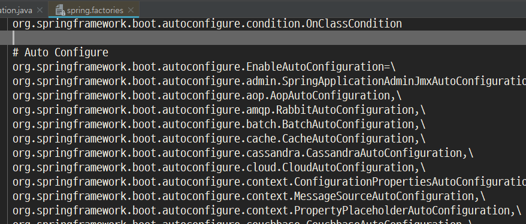
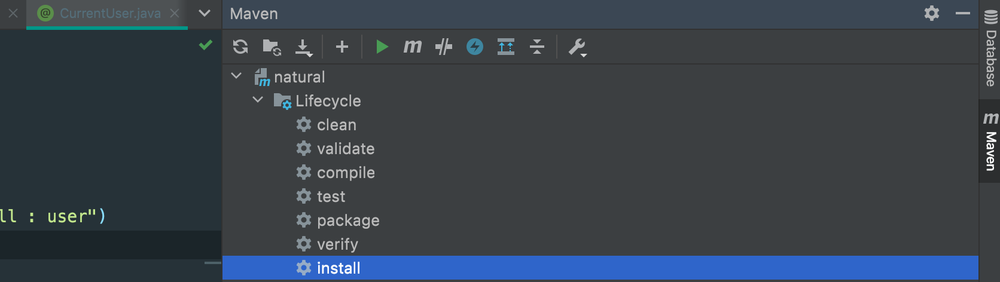

## 스프링의 시작지점

```java
@SpringBootApplication
public class Application {

    public static void main(String[] args) {
        SpringApplication.run(Application.class, args);
    }
}
```

### @SpringBootApplication

- 위 애노테이션에 타고 들어가보면 `@SpringBootConfiguration`, `@ComponentScan`, `@EnableAutoConfiguration` 세 개의 애노테이션이 합쳐져 있는 형태이다.

스프링 부트 어플리케이션이 Bean을 등록하는 과정은 아래와 같다.

> 1단계: @ComponentScan으로 찾은 Bean을 등록한다.
> 2단계: @EnableAutoConfiguration으로 추가적으로 읽어온 Bean을 등록한다.

### @ComponentScan

- 자기 자신이 위치한 패키지로부터 하위의 패키지를 스캔해서 Bean을 등록한다. 대표적인 검색대상은 `@Configuration`, `@Repository`, `@Service`, `@Controller`, `@RestController`이다.

### @EnableAutoConfiguration

- `Configuration`이란 Bean을 읽어오기 위한 조건이 정의된 **설정 파일**이다.
- `org.springframework.boot.autoconfigure` 패키지에서 `spring.factories` 파일을 열어보면 아래와 같은 수많은 키값이 적혀있다.



- 위 파일에 정의된 Configuration에 의해 `Bean`들이 생성되게 된다.

## Configuration 작성

- Configuration은 별도의 프로젝트로 작성하여 jar 형태로 사용할 수 있다.
- 작성이 끝난 뒤에는 `mvn install` 명령을 통해 **Local Repository**에 설치되어 다른 프로젝트에서 활용할 수 있다.
- 아래와 같이 IntelliJ 메뉴를 통해 설치할 수 도 있다.



### 의존성 설정

- `Configuration`을 만들기 위해 먼저 `pom.xml`부터 설정한다.

```xml
<dependencies>
	<dependency>
		<groupId>org.springframework.boot</groupId>
		<artifactId>spring-boot-autoconfigure</artifactId>
	</dependency>
	<dependency>
		<groupId>org.springframework.boot</groupId>
		<artifactId>spring-boot-autoconfigure-processor</artifactId>
		<optional>true</optional>
	</dependency>
</dependencies>

<!-- 위에서 추가한 두 개의 의존성의 버전 관리를 위한 영역 -->
<dependencyManagement>
	<dependencies>
		<dependency>
			<groupId>org.springframework.boot</groupId>
			<artifactId>spring-boot-dependencies</artifactId>
			<version>2.0.3.RELEASE</version>
			<type>pom</type>
			<scope>import</scope>
		</dependency>
	</dependencies>
</dependencyManagement>

```

### Configuration 작성

- `@Configuration`을 붙인 클래스 내에 `Bean`을 선언한다.
- `@ConditionalOnMissingBean`을 주의하자. 없는 경우 명시적인 Bean보다 Configuration이 우선순위를 가진다.

```java
import org.springframework.context.annotation.Bean;
import org.springframework.context.annotation.Configuration;

@Configuration
public class PersonConfiguration {

	@Bean
	@ConditionalOnMissingBean	// 이 Configuration을 사용하는 프로젝트에서 같은 Bean이 있으면 생성하지 않는다.
	public Person person() {
		Person person = new Person();
		person.setAge(40);
		person.setName("깨발자");
		return person;
	}
}
```

### spring.factories 파일 작성

- `main/resources/META-INF` 디렉토리에 `spring.factories` 파일을 생성한다.
- 아래와 같이 만들어준 설정 파일을 명시적으로 정의한다.

```
org.springframework.boot.autoconfigure.EnableAutoConfiguration=com.develop4.PersonConfiguration
```

- 모든 작성이 끝났으면 처음에 설명한 것처럼 `mvn install`을 통해 설치한다.

### 다른 프로젝트에서 Configuration 사용

- 아래와 같이 `pom.xml`에 설치한 의존성을 추가한다.

```xml
<dependency>
	<groupId>com.develop4</groupId>
	<artifactId>cfg-test-spring-boot-starter</artifactId>
	<version>1.0-SNAPSHOT</version>
</dependency>
```

- 아래와 같이 Bean이 자동 생성됨을 확인할 수 있다.

```java
@Component
public class PersonRunner implements ApplicationRunner {

	@Autowired
	Person person;	// 이 프로젝트에서는 만든적이 없는 Bean이 Configuration을 통해 주입된다.

	public void run(ApplicationArguments args) throws Exception {
		System.out.println(person);
	}
}
```

## 스프링 부트에서 어떻게 바로 컨트롤러를 만들어낼 수 있을까?

```java
@RestController
public class UserController {
	@GetMapping
	public String hello() {
		return "hello";
	}
}
```

- 생각해보면 우리는 그냥 클래스를 하나 만들었을 뿐이다. 물론 `@RestController`를 통해 Bean으로 등록이 될거고 어떻게든 가져가서 REST API를 하나 만들어내겠지라고 생각해볼 수는 있다.
- 구체적인 구현은 `WebMvcAutoConfiguration`이라는 AutoConfiguration을 통해 설정된다. Converter, Interceptor, ResourceHandler, CorsMapping, ViewResolver, ArgumentResolver, Message Converter와 같은 다양한 설정이 제공된다. 기본적으로 모두 설정되어 있으므로 특별한 일이 없다면 위처럼 바로 웹 개발이 가능한 것이다.

---

[1] 백기선, 인프런, 스프링 부트 개념과 활용
