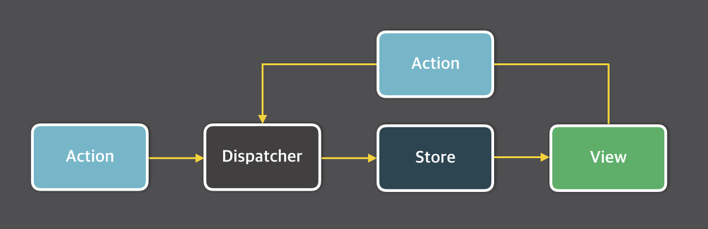

# 새 공식문서

`React`가 16 버전을 시작으로 `hooks`를 지원하기 시작하고 심지어는 적극 권장하게 되었다. 하지만 리액트 공식문서는 여전히 클래스 기반의 내용도 많고 구성도 번잡한 느낌이 있었는데, 새 공식문서가 작성되었다. 베타가 끝나면 기존 문서를 대체할 예정이라고 한다. 기존 문서와의 큰 차이점은,

- 모든 설명은 클래스가 아닌 **hooks**를 사용하여 작성되었다.
- 대화형 예제와 시각적 다이어그램이 추가되었다.
- 가이드에는 이해를 확인하기 위한 과제가 포함되어있다.

# Component

React를 사용하면 마크업, CSS 및 JavaScript를 앱의 재사용 가능한 UI 요소인 `Component`로 결합할 수 있다. (심지어 Tailwind CSS와 같은 Atomic CSS를 사용하면 CSS 요소도 하나로 통합할 수 있다) 프로젝트가 성장함에 따라 (Chakra UI, Material UI와 같은) 이미 작성된 Component를 재사용하여 많은 디자인을 구성하고 개발속도를 높일 수 있다.

```jsx
function Gallery() {
  return (
    <section>
      <h1>Amazing!</h1>
      <Profile />
      <Profile />
    </section>
  );
}
```

React Component는 다음을 제외하고 **일반 JavaScript 함수**이다.

- Component의 이름은 항상 대문자로 시작한다.
- JSX 마크업을 반환한다.

## JSX

`JSX`는 JavaScript 파일 내에 HTML과 유사한 마크업을 작성할 수 있는 JavaScript용 구문 확장이다. (JSX가 React의 구성 요소는 아니다. 독립적으로 사용할 수 있다.) 웹은 점차 발전하며 대화식의 어플리케이션이 되어갔고 논리가 점점 컨텐츠를 결정하기 시작했다. 즉 JavaScript가 HTML을 담당하기 시작했다. 이 것이 React에서 렌더링 로직과 마크업이 같은 장소(컴포넌트)에 함께 존재하는 이유이다. 렌더링 로직과 마크업을 함께 유지하면 **편집할 때마다 서로 동기화된 상태를 유지할 수 있다**.

### 규칙

- 단일 루트 요소 반환
- 모든 태그 닫기
- 속성이름은 카멜 케이스로 짓는다. (JSX의 속성은 자바스크립트 객체가 되기 때문에 명명규칙과 관련)

### 중괄호 사용

JSX에서는 중괄호를 사용하여 **내부에서 JavaScript를 사용**할 수 있다.

```jsx
function TodoList() {
	const name = ‘Zara’;
	return (
		<h1>{name}’s To Do List</h1>
	)
}
```

## 컴포넌트에 props 전달하기

React Component는 props를 사용하여 서로 통신한다. 모든 상위 Component는 `props`를 제공하여 하위 Component에 일부 정보를 전달할 수 있다. Props의 형태는 HTML의 속성과 유사하지만 객체, 배열 및 함수를 포함한 모든 JavaScript 값을 전달할 수 있다. **Props는 읽기 전용 스냅샷이다. 모든 렌더링 마다 새 버전의 Props를 받는다.**

```jsx
function Profile() {
	return (
		<Avatar size={100} person={{name: ‘Lin’, id: ‘1bX5H6’} />	// {{ }}은 JSX 중괄호 내부의 자바스크립트 객체일 뿐이다.
	);
}

function Avatar({ size, person }) {
	// size와 person을 Props라고 한다.
	// Props는 Component에 대한 유일한 인수이다.
}
```

## JSX를 자식으로 전달하기

HTML 태그를 중첩하는 것처럼 Component를 중첩하고 싶을 수도 있다. JSX 태그 내부에 컨텐츠를 중첩하면 상위 Component는 Props에서 해당 컨텐츠를 수신한다.

```jsx
<Card>
	<Avatar />
</Card>

function Card({ children }) {
	return (
		<div className=“card”>
			{children}		// <Avatar>가 될 것이다.
		</div>
	);
}
```

## 조건부 렌더링

`삼항 연산자`나 `논리 연산자`를 활용하는 방법이 일반적이지만 아래와 같이 조건문을 이용해서 서로 다른 JSX 트리를 반환하는 방법도 있다.

```jsx
function Item({ name, isPacked }) {
	if (isPacked) {
		return <li className=“item”>{name} ✔️</li>;
	}
	return <li className=“item”>{name}</li>;
}
```

## 렌더링 목록

데이터 컬렉션에서 유사한 여러 구성 요소를 표시하려는 경우가 많다. JavaScript 배열 메서드를 사용하여 데이터 배열을 조작할 수 있다. 주로 `filter()`나 `map()` 메서드를 활용하여 데이터 배열을 필터링하고 구성 요소 배열로 변환한다. 다만 **map() 등에 의해 나열된 Component는 항상 키가 필요하다. 형제 간의 항목을 고유하게 식별하기 위함이다**.

### 키 규칙

- 키는 형제 간에 고유해야 한다.
- 키는 변경되어서는 안되며 그렇지 않으면 목적을 달성하지 못한다.

예를 들어 아래와 같이 virtual DOM이 변경되는 경우, 재조정과정에서 뒤에 3만 추가되면 되므로 3만이 리랜더링된다.

```jsx
// before virtual DOM
<ul>
	<li>1</li>
	<li>2</li>
</ul>

// after virtual DOM
<ul>
	<li>1</li>
	<li>2</li>
	<li>3</li>
</ul>
```

하지만 아래와 같이 3, 1, 2의 순서가 되면 리액트는 모든 `<li>` 요소가 바뀌었다고 생각하고 해당 요소들을 모두 리랜더링하는 성능 문제가 있다. 만약 **키가 있다면 키 값에 의한 비교를 통해 변경된 요소를 인지할 수 있고 해당 요소만 리랜더링한다.**

```jsx
// before virtual DOM
<ul>
	<li>1</li>
	<li>2</li>
</ul>

// after virtual DOM
<ul>
	<li>3</li>
	<li>1</li>
	<li>2</li>
</ul>
```

## Component와 불변성

React는 작성하는 모든 Component가 `순수 함수`라고 가정한다. 즉, 작성하는 **모든 Component는 동일한 입력이 주어지면 항상 동일한 JSX를 반환**해야 한다.

예를 들어 아래와 같은 코드는 규칙을 위반한다.

```jsx
let guest = 0; // 전역 변수

function Cup() {
  guest = guest + 1;
  return <h2>Tea Cup for #{guest}</h2>;
}
```

아래와 같은 모습으로 바뀌어야 할 것이다.

```jsx
function TeaSet() {
  return (
    <>
      <Cup guest={1} />
      <Cup guest={2} />
      <Cup guest={3} />
    </>
  );
}

function Cup({ guest }) {
  return <h2>Tea Cup for #{guest}</h2>;
}
```

### 사이드 이펙트를 일으킬 수 있는 곳

- 함수형 프로그래밍은 순수 함수에 의존하지만 프로그래밍을 하다보면 어느 시점, 어딘가에서는 **무언가가 변경되어야 한다**. 이러한 변경(화면 업데이트, 애니메이션 시작, 데이터 변경)을 사이드 이펙트라고 한다. 렌더링 중에가 아니라 **측면에서** 발생하는 것이다.
- React에서 사이드 이펙트는 일반적으로 **이벤트 핸들러 내부에 속한다**. 이벤트 핸들러는 Component 내부에 정의되어 있지만 **렌더링 중에는 실행되지 않는다**. 따라서 **이벤트 핸들러는 순수할 필요가 없다**.
- `useEffect` 옵션을 사용하면 사이드 이펙트에 대한 올바른 이벤트 핸들러를 찾을 수 없는 경우에도 Component를 호출하여 반환된 JSX와 연결할 수 있다. 이는 렌더링 후 사이드 이펙트가 허용될 때 나중에 실행하도록 React에게 지시한다. 그러나 이 접근 방식은 최후의 수단이어야 한다.

### React가 순수 함수에 관심을 갖는 이유

- Component는 서버와 같은 다른 환경에서 실행될 수 있다. 동일한 입력에 대해 동일한 결과를 반환하기 때문에 하나의 Component가 많은 사용자 요청을 처리할 수 있다.
- 입력이 변경되지 않은 렌더링 구성요소를 건너뛰어 성능을 향상시킬 수 있다. 순수 함수는 항상 동일한 결과를 반환하므로 캐시해도 안전하다.
- 깊은 컴포넌트 트리를 렌더링하는 동안 일부 데이터가 변경되면 React는 오래된 렌더링을 완료하는데 시간을 낭비하지 않고 렌더링을 다시 시작할 수 있다. 순수 함수는 언제든지 계산을 중단하는 것을 안전하게 만든다.

# 상호 작용 추가

화면의 일부 항목은 사용자 입력에 따라 업데이트된다. React에서는 **시간이 지남에 따라 변경되는 데이터를 상태**라고 한다. 모든 Component에 상태를 추가하고 필요에 따라 업데이트 할 수 있다.

## 이벤트에 응답하기

- 이벤트 핸들러는 사이드 이펙트 처리를 위한 최고의 장소이다. **렌더링 함수와 달리 이벤트 핸들러는 순수 함수일 필요가 없으므로** 무언가를 변경하기에 좋은 장소이다.
- 이벤트 핸들러에 전달된 함수는 호춣되지 않고 전달되어야 한다.

```jsx
// 올바른 사용법. handleClick은 이벤트 핸들러로 전달되어 React가 기억하고 클릭시 함수를 호출
<button onClick={handleClick}>

// 잘못된 사용법. 클릭없이 렌더링하는 동안 즉시 handleClick() 함수가 실행된다. 자바스크립트는 JSX 내부에서 바로 실행된다.
<button onClick={handleClick()}>

// 권장되는 사용법. 인라인 코드를 전달하면 클릭시 실행되지 않으며 Component가 렌더링 될 때마다 실행된다. 즉, 렌더링마다 내부의 코드를 실행하는 대신 나중에 호출함 함수를 만든다.
<button onClick={() => alert(‘…’)}>
```

## Component의 메모리(state)

### Hook

- useState와 같이 React에서 use 접두사로 시작하는 기능들을 `useHook`이라고 한다.
- Hook은 React가 렌더링되는 동안에만 사용할 수 있는 특수 기능이다.
- Hook은 Component 최상위 수준에서만 호출할 수 있다. 조건문, 루프, 중첩 함수 등에서 Hook을 호출할 수 없다.

### 일반 변수로는 충분하지 않은 이유

- **지역 변수는 렌더링 간에 지속되지 않는다.** React는 그 Component를 렌더링할 때 처음부터 다시 렌더링한다. 로컬 변수에 대한 변경사항은 고려되지 않는다.
- **지역 변수를 변경해도 렌더링이 트리거되지 않는다.** React는 새 데이터로 Component를 다시 렌더링해야 한다는 것을 인식하지 못한다.

### useState

위처럼 일반 변수로 해결하지 못하는 문제를 해결하기 위한 Hook이 `useState`이다. useState에 저장된 데이터는 React에 의해 기억되어 다음 렌더링에도 사용되며, 변경시 렌더링이 트리거된다.

```jsx
const [index, setIndex] = useState(0);
```

## 렌더링 및 커밋

### 1단계: 렌더링 트리거

Component가 렌더링되는 데에는 두 가지 이유가 있다.

1. Component의 초기 렌더링인 경우
2. Component 또는 상위 Component의 상태가 업데이트되는 경우

### 2단계: React는 Component를 렌더링한다

렌더링을 트리거한 후 React는 Component 함수를 호출하여 화면에 표시할 내용을 파악한다. **렌더링이란 Component 함수를 호출하는 동작**이다.

### 3단계: React는 DOM에 대한 변경사항을 커밋한다

Component를 렌더링(호출)한 후 React는 DOM을 수정한다.

- 초기 렌더링인 경우 `appendChild()` DOM api를 사용하여 모든 DOM 노드를 화면에 표시한다.
- 재랜더링인 경우 필요한 최소한의 작업(**렌더링하는 동안 Diff를 통해 계산됨**)을 적용하여 DOM이 최신 렌더링 출력과 일치하도록 한다.

## 상태를 스냅샷으로

useState의 상태는 읽고 쓸 수 있는 일반 JavaScript 변수처럼 보일 수 있지만, **상태는 스냅샷처럼 작동한다.** Component의 메모리로서 **State는 함수 외부에 있는 것처럼 React 자체에 살아있다.**

React가 Component를 다시 렌더링할 때,

1. React는 Component 함수를 호출한다.
2. 함수가 새 JSX 스냅샷을 반환한다.
3. React는 반환된 스냅샷과 일치하도록 화면을 업데이트한다.
4.

구체적인 예를 들자면 아래의 Component는 실행해도 number가 1만 증가한다.

```jsx
function Counter() {
	const [number, setNumber] = useState(0);
	return (
		<>
			<button onClick={() => {
				setNumber(number + 1);
				setNumber(number + 1);
				setNumber(number + 1);
			}}Plus three</button>
		</>
	);
}
```

**상태를 설정하면 다음 렌더링에 대해서만 변경된다.** 첫번째 렌더링동안 number는 0이며 다음 렌더링까지는 즉시 업데이트되지 않는다. 따라서 setNumber가 세 번 호출되어도 0 + 1로 계산되기에 값은 1로 업데이트된다.

이는 비동기 상황에서도 마찬가지이다. 화면에는 다음 렌더링때 숫자가 5로 바뀌겠지만, 3초가 지나도 alert은 0을 표시한다. **상태 변수의 값은 이벤트 핸들러의 코드가 비동기식인 경우에도 렌더링 내에서 절대 변경되지 않는다.**

```jsx
function Counter() {
	const [number, setNumber] = useState(0);
	return (
		<>
			<h1>{number}</h1>
			<button onClick={() => {
				setNumber(number + 5);
				setTimeout(() => {
					alert(number);
				}, 3000);
			}}Plus</button>
		</>
	);
}
```

정리하자면 **React는 한 레더링의 이벤트 핸들러 내에서 상태 값을 고정으로 유지**한다. 코드가 실행되는 동안 상태가 변경되었는지 여부를 걱정할 필요가 없다.

## 상태 업데이트 대기

상태 변수를 변경하면 렌더링이 대기열에 추가된다. 즉, **React는 상태 업데이트를 처리하기 전에 이벤트 핸들러의 모든 코드가 실행될 때까지 기다린다.** 이는 레스토랑에서 주문을 받는 웨이터로 생각해볼 수 있다. 첫 주문을 받더라도 주방으로 바로 뛰어가는 것이 아니라 주문을 완료하고 변경할 수 있으며 테이블에 있는 다른 사람들의 주문도 받을 수 있는 것이다.

왜 렌더링이 즉시 트리거되지 않는 것일까? 매번 상태의 변경마다 재렌더링이 이루어진다면 성능에 좋지 않은 영향을 주기 때문이다. 작업 대기열이 끝났을때의 최종 상태만을 한번 렌더링하면 된다.

### 상태 업데이터

앞서 말했듯 상태는 스냅샷처럼 동작한다. 하지만 렌더링하기 전에 최신 상태를 읽고 싶은 경우도 있을 것이다. 이럴 때 상태 업데이터가 쓰일 수 있다. (하지만 드물다.)

```jsx
function Counter() {
	const [number, setNumber] = useState(0);
	return (
		<>
			<button onClick={() => {
				setNumber(number + 5);
				setNumber(n => n + 1);	// 업데이터 함수
			}}Plus three</button>
		</>
	);
}
```

위 코드의 경우 상태는 `6`으로 업데이트된다. 업데이터 함수를 사용하는 경우 전달되는 함수가 대기열에 들어가게 되고, 업데이터 함수는 대기열이 모두 끝난 뒤 최종상태를 가지고 호출된다.

## 상태의 개체 업데이트

상태는 객체를 포함하여 모든 JavaScript 값을 가질 수 있다. 하지만 상태에 있는 객체를 직접 변경해서는 안된다. 대신 객체를 업데이트하려면 **새 개체(또는 기존 객체의 복사본)를 만든ㄷ 다음 해당 복사본을 사용하도록** 상태를 설정해야 한다. 즉, 상태로 설정한 모든 JavaScript 객체를 `읽기 전용`으로 처리해야 한다.

흔히 이를 처리하기 위해 `Spread` 문법이 많이 사용된다.

```jsx
const [person, setPerson] = useState({
	firstName: “Kim”,
	lastName: “hoo”,
	email: “test@test.com”
});

// Spread 문법을 사용하고 필드를 추가뿐만 아니라 Override(firstName)할 수 있다.
setPerson({…person, firstName: “You”});
```

### 배열의 경우

배열 역시 객체이므로 동일한 처리가 필요하다. `filter()`, `map()` 함수는 새 배열을 반환하므로 이용하면 편리하다. `reverse()`, `sort()` 등은 원본을 변경하므로 직접 사용할 수 없다.

### Immer 라이브러리 활용

Immer 라이브러리는 프록시를 사용해서 자동으로 객체의 어떤 부분이 변경되면 새로운 객체를 생성해준다.

```jsx
import { useImmer } from ‘use-immer’;

function Form() {
	const [person, updatePerson] = useImmer({
		name: “niki”,
		title: “blue”
	});

	updatePerson(draft => {
		draft.name = “change”	// 변경이 감지된다.
	});
}
```

# 상태 관리

어플리케이션이 성장함에 따라 상태가 구성되는 방식과 구성 요소 간에 데이터가 흐르는 방식에 대해 알아두는 것이 좋다. React는 `선언적 방법`을 사용하여 UI를 조작한다. **UI의 개별 부분을 직접 조작하는 대신** 구성 요소가 있을 수 있는 다양한 상태를 설명하고 사용자 입력에 대한 응답으로 상태를 전환한다. 이는 디자이너가 UI에 대해 생각하는 방식과 유사하다.

## 상태로 입력에 반응하기

### 명령형 UI

- 양식에 무언가를 입력하면 제출 버튼이 활성화된다.
- 제출을 누르면 양식과 버튼이 모두 비활성화되고 스피너가 나타난다.
- 네트워크 요청이 성공하면 양식이 숨겨지고 감사합니다라는 메시지가 나타난다.
- 네트워크 요청이 실패하면 오류 메시지가 나타나고 양식이 다시 활성화된다.

이러한 상호작용을 직접 구현하는 방식을 `명령형 프로그래밍`이라고 한다. 고전적인 웹 프로그래밍에서 DOM 요소를 `getElementById()` 등으로 얻어와서 조작하는 형태가 이에 해당한다. UI를 조작하는 것은 격리된 예에서는 충분히 잘 작동하지만 더 복잡한 시스템에서는 관리하기가 기하급수적으로 어려워진다. 이러한 문제를 해결하기 위해 React가 만들어졌다.

### 선언적 UI

React는 UI를 직접 조작하지 않는다. 즉, 구성 요소를 직접 활성화, 비활성화, 표시 또는 숨기지 않는다. 대신 **표시할 내용을 선언하면 React가 UI를 업데이트 하는 방법을 알아낸다.** 위 명령형 절차는 아래와 같이 선언적으로 생각해볼 수 있을 것이다.

- 구성 요소의 다양한 시각적 상태 식별
- 이러한 상태 변경을 유발하는 요인 결정
- useState를 사용하여 메모리의 상태를 나타내기
- 필수가 아닌 상태 변수 제거
- 이벤트 핸들러를 연결하여 상태 설정

## 상태 로직을 리듀서로 추출하기

```jsx
import { useReducer } from "react";
import AddTask from "./AddTask.js";
import TaskList from "./TaskList.js";

export default function TaskApp() {
  const [tasks, dispatch] = useReducer(tasksReducer, initialTasks);

  function handleAddTask(text) {
    dispatch({ type: "added", id: nextId++, text: text });
  }

  function handleChangeTask(task) {
    dispatch({ type: "changed", task: task });
  }

  function handleDeleteTask(taskId) {
    dispatch({ type: "deleted", id: taskId });
  }

  return (
    <>
      <h1>Prague itinerary</h1>
      <AddTask onAddTask={handleAddTask} />
      <TaskList
        tasks={tasks}
        onChangeTask={handleChangeTask}
        onDeleteTask={handleDeleteTask}
      />
    </>
  );
}

function tasksReducer(tasks, action) {
  switch (action.type) {
    case "added": {
      return [...tasks, { id: action.id, text: action.text, done: false }];
    }
    case "changed": {
      return tasks.map((t) => {
        if (t.id === action.task.id) {
          return action.task;
        } else {
          return t;
        }
      });
    }
    case "deleted": {
      return tasks.filter((t) => t.id !== action.id);
    }
    default: {
      throw Error("Unknown action: " + action.type);
    }
  }
}

let nextId = 3;
const initialTasks = [
  { id: 0, text: "Visit Kafka Museum", done: true },
  { id: 1, text: "Watch a puppet show", done: false },
  { id: 2, text: "Lennon Wall pic", done: false },
];
```

## 컨텍스트를 사용하여 데이터를 심층적으로 전달하기

테마, 로그인한 계정, 라우팅 정보, 전역적인 상태 등을 관리하게 좋다고 할 수 있으나 다른 전역 데이터 관리 도구를 사용하는 것이 더 낫다고 생각된다.

```jsx
import { useContext } from 'react';
import { LevelContext } from './LevelContext.js';

export default function Section({ children }) {
  const level = useContext(LevelContext);
  return (
    <section className="section">
      <LevelContext.Provider value={level + 1}>
        {children}
      </LevelContext.Provider>
    </section>
  );
}

export default function Page() {
  return (
    <Section level={1}>
      ...
      <Section level={2}>
        ...
        <Section level={3}>
          ...
	);
}
```

## FLUX

페이스북이 자사 시스템을 구현하면서 기존의 MVC 아키텍쳐는 양방향 데이터 흐름을 가지고 있기 때문에 기능을 추가하면 추가할 수록 그 복잡성이 기하급수적으로 증가함을 느꼈다고 한다. 양방향 데이터 흐름 때문에 복잡성이 생겼으므로 이를 단방향 데이터 흐름으로 만들어낸 아키텍쳐가 Flux이다. 이러한 아키텍처를 잘 구현한 라이브러리가 Redux이다.



- `액션 생성자(Action creator)`: 액션이란 어떤 행위인지와 그 행위로부터 넘겨받은 값들을 가진 하나의 객체를 말한다. 따라서 어떤 액션인지를 가리키는 type 과 넘겨받은 값인 payload 를 가진다. 액션 생성자는 기존 상태를 변경하기 위한 액션의 생성을 담당하며 해당 액션을 생성해서 디스패쳐에 넘겨준다.
- `디스패쳐(Dispatcher)`: 디스패쳐는 모든 액션들을 받아서 의존성을 적절히 처리해준 다음 모든 스토어에게 넘긴다. 여기서 중요한 점은 모든 스토어가 모든 액션을 받는다는 것이다.
- `스토어(Store)`: 스토어는 모든 액션을 받아서 자신에게 적합한 액션이 어떤 건지 필터링한다. 이후 상태값을 변경하고 자신에게 연결된 컨트롤러 뷰에게 상태가 변화되었음을 알린다.
- `컨트롤러 뷰(Controller View)`와 `뷰(View)`: 여기서 컨트롤러 뷰는 전체적으로 화면에 나타는 자식 뷰들과 스토어를 연결하는 매개체이다. 자식 뷰들은 컨트롤러 뷰에게 변화된 상태를 받고 그 상태에 따라 다시 렌더링이 된다.

# 탈출 해치

React를 외부 시스템에 연결할 수 있는 탈출용 해치에 대해서 정리한다. 대부분의 애플리케이션 로직과 데이터 흐름은 이러한 기능에 의존해서는 안된다.

## Ref로 값 참조하기

Component가 일부 정보를 기억하되 해당 정보가 새 렌더링을 트리거하는 것을 원치 않는 경우가 있을 수 있다. (일반 변수는 기억되지 않고 렌더링을 트리거하지도 않는다.) 이런 경우 `ref`를 사용할 수 있다. 이 값은 의도적으로 변경 가능하므로 읽고 **쓸 수** 있다. 이것이 React의 단방향 데이터 흐름에서 탈출 해치가 되는 이유이다.

```jsx
import { useRef } from "react";

export default function Counter() {
  let ref = useRef(0);

  function handleClick() {
    ref.current = ref.current + 1;
    alert("You clicked " + ref.current + " times!");
  }

  return <button onClick={handleClick}>Click me!</button>;
}
```

`ref.current`는 읽고 수정할 수 있는 속성이 있는 일반 JavaScript 객체이다. 다만 주의할 점은 스냅샷이 아니기 때문에 렌더링하는 동안 값을 읽거나 쓰지 않도록 주의해야 한다. React는 언제 변경될지 모르기 때문에 동작을 예상하기 어렵기 때문이다.

## Ref로 DOM 조작하기

마치 명령형 UI처럼 특정 DOM을 조작하는데 ref가 쓰일 수 있다. 다만 이는 코드를 취약하게 만드므로 최대한 지양하는 것이 좋다. 순수 함수이어야 하는 렌더링에서는 이를 지양하고 꼭 사용해야 한다면 사이드 이펙트를 처리하는 이벤트 핸들러에서 사용하는 것이 좋다. 예컨데 스크롤이나 비디오 재생의 중지, 포커싱 등 화면 구성에 영향을 주지 않는 작업에는 사용될만하다.

```jsx
import { useRef } from "react";

export default function Form() {
  const inputRef = useRef(null);

  function handleClick() {
    inputRef.current.focus();
  }

  return (
    <>
      <input ref={inputRef} />
      <button onClick={handleClick}>Focus the input</button>
    </>
  );
}
```

## Effect

`Effect`를 사용하면 렌더링 후 일부 코드를 실행할 수 있다.

### Effect란 무엇이며 이벤트와 어떻게 다른가?

- 렌더링 코드는 Component의 최상위 수준이 있다. 그리고 렌더링 코드는 순수 함수이어야 한다.
- 이벤트 핸들러는 Component 내부의 중첩된 함수이다. 그리고 `사이드 이펙트`를 처리한다.

지금까지 알게된 사실은 위와 같지만 이것만으로는 충분하지 않다. 예를 들어 `ChatRoom` Component가 화면이 보일때마다 채팅 서버에 연결해야 한다면, 서버에 연결하는 것은 **순수한 계산이 아니므로 사이드 이펙트이며 이는 렌더링 중에 발생할 수 없다.** 그리고 **이는 이벤트가 아니므로** 이 사이드 이펙트는 이벤트 핸들러를 통해 처리할 수 없다.

**Effect를 사용하면 특정 이벤트가 아니라 렌더링 자체로 발생하는 사이드 이펙트를 처리할 수 있다.** 채팅에서 메시지를 보내는 것은 사용자가 특정 버튼을 클릭하여 발생하는 이벤트이지만, 서버 연결을 설정하는 것은 상호 작용과 관계없이 발생해야하기 때문에 Effect이다. Effect는 화면 업데이트 후 랜더링 프로세스가 끝날때 Component를 일부 외부 시스템과 동기화하기에 좋은 시간이다. 물론 Effect없이 구현할 수 있는지 고려하는 것이 먼저이다.

### 1단계: Effect 선언

**useEffect는 해당 렌더링이 화면에 반영될 때까지 코드 실행을 지연한다.**

예를 들어 아래와 같은 코드는 Video DOM 요소에 접근하는데 Component 내부에 코드가 있기 때문에 렌더링 중에 실행된다. 따라서 DOM 노드가 생성되지 않았을 때 접근하게되면 이 코드는 정상적으로 동작하지 않는다. 렌더링은 순수한 계산이어야 한다.

```jsx
function VideoPlayer({ src, isPlaying }) {
  const ref = useRef(null);

  if (isPlaying) {
    ref.current.play(); // Calling these while rendering isn't allowed.
  } else {
    ref.current.pause(); // Also, this crashes.
  }

  return <video ref={ref} src={src} loop playsInline />;
}
```

해결책은 사이드 이펙트를 렌더링에서 빼내기 위해 `useEffect`로 래핑하는 것이다. 그럴 경우 React는 화면을 먼저 업데이트한 뒤 Effect를 실행시킨다. 아래 코드는 정상적으로 동작한다.

```jsx
function VideoPlayer({ src, isPlaying }) {
  const ref = useRef(null);

  useEffect(() => {
    if (isPlaying) {
      ref.current.play();
    } else {
      ref.current.pause();
    }
  });

  return <video ref={ref} src={src} loop playsInline />;
}
```

### 2단계: 효과 종속성 지정

기본적으로 Effect는 렌더링할 때마다 실행되지만, 종종 이것은 개발자가 원하는 것이 아니다.

```jsx
function VideoPlayer({ src, isPlaying }) {
  const ref = useRef(null);

  useEffect(() => {
    if (isPlaying) {
      ref.current.play();
    } else {
      ref.current.pause();
    }
  }, [isPlaying]); // 변경된 부분

  return <video ref={ref} src={src} loop playsInline />;
}
```

useEffect에 `[isPlaying]`과 같이 종속성을 지정하는 경우, **이전 렌더링과 동일한 isPlaying일때 Effect 재실행을 건너뛴다.**

종속성 배열이 없는 동작과 빈 종속성 배열이 있는 useEffect는 동작이 매우 다르므로 주의해야 한다.

```jsx
useEffect(() => {}); // 매 렌더링마다 호출된다
useEffect(() => {}, []); // Component가 마운트되는 딱 한번만 실행된다
```

### 3단계: 필요한 경우 정리 추가

Effect에서 정리함수를 반환하면 Component가 마운트 해제될 때 마지막으로 한번 호출한다. 해제가 제대로 되지 않는 경우 렌더링마다 Leakage가 쌓여 성능에 악영향을 줄 수도 있으니 주의해야 한다.

```jsx
useEffect(() => {
  const connection = createConnection();
  connection.connect();
  return () => {
    connection.disconnect();
  };
}, []);
```

### 함정

아래와 같은 코드는 무한 루프를 생성한다. Effect의 결과가 렌더링을 트리거하기 때문이다.

```jsx
const [count, setCount] = useState(0);
useEffect(() => {
  setCount(count + 1);
});
```

## Effect가 필요하지 않은 경우

일부 코드가 `Effect`에 있어야 하는지 `이벤트 핸들러`에 있어야 하는지 확실하지 않은 경우, Component가 사용자에게 **보여졌기 때문에** 실행해야하는 코드에만 Effect를 적용해야 한다.

```jsx
function Form() {
  const [firstName, setFirstName] = useState("Taylor");
  const [lastName, setLastName] = useState("Swift");

  // Avoid: redundant state and unnecessary Effect
  const [fullName, setFullName] = useState("");
  useEffect(() => {
    setFullName(firstName + " " + lastName);
  }, [firstName, lastName]);
  // ...
}
```

위 코드는 복잡하고 무의미하다. **기존 props 또는 state에서 무언가를 계산할 수 있는 경우 state에 넣지말라.** 대신 렌더링중에 계산하라.

```jsx
function Form() {
  const [firstName, setFirstName] = useState("Taylor");
  const [lastName, setLastName] = useState("Swift");
  // ✅ Good: calculated during rendering
  const fullName = firstName + " " + lastName;
  // ...
}
```

## Effect의 수명 주기

Effect는 Component와 수명 주기가 다르다. Component는 `마운트`, `업데이트`, `마운트 해제`될 수 있다. Effect는 두 가지만 할 수 있다. **동기화를 시작하는 것**과 **나중에 동기화를 중지하는 것**이다. Effect가 변할 수 있는 props와 state에 의존하는 경우 이 주기는 여러번 발생할 수 있다.

Component와 Effect의 수명 주기는 다르고 Component는 수시로 재랜더링될 수 있다. 재랜더링은 다시 Effect의 수명 주기에 영향을 줄 수 있으므로, **Componet의 수명 주기가 어떠하건 동기화를 시작하는 방법과 중지하는 방법을 잘 정의하면 된다.** 재랜더링이 되더라도 Effect의 시작과 끝이 호출되고 잘 정의되어 있다면 문제를 일으키지 않을 것이다.

### 코드의 각 Effect는 개별적이고 독립적인 동기화 프로세스를 나타내야 한다

Effect는 코드의 반응 블록이다. 내부에서 읽은 값이 변경되면 다시 동기화된다. 상호작용당 한번만 실행되는 이벤트 핸들러와는 달리 Effect는 동기화가 필요할 때마다 실행된다. 실행의 블록을 최소할 필요가 있다.

```jsx
function ChatRoom({ roomId }) {
  useEffect(() => {
    logVisit(roomId); // ???

    const connection = createConnection(serverUrl, roomId);
    connection.connect();
    return () => {
      connection.disconnect();
    };
  }, [roomId]);
  // ...
}
```

아래와 같이 두 개의 useEffect로 분리되는 것이 바람직하다.

```jsx
function ChatRoom({ roomId }) {
  useEffect(() => {
    logVisit(roomId);
  }, [roomId]);

  useEffect(() => {
    const connection = createConnection(serverUrl, roomId);
    // ...
  }, [roomId]);
  // ...
}
```

## Effect 종속성 제거

이전에 소개한 `업데이터 함수`를 이용해서 불필요한 종속성을 제거할 수 있다.

```jsx
function ChatRoom({ roomId }) {
  const [messages, setMessages] = useState([]);
  useEffect(() => {
    const connection = createConnection();
    connection.connect();
    connection.on("message", (receivedMessage) => {
      setMessages([...messages, receivedMessage]);
    });
    return () => connection.disconnect();
  }, [roomId, messages]); // 종속성(roomId, messages)
  // ...
}
```

업데이터 함수를 통해 `setMessages()`만을 이용하고 messages를 쓰지 않도록 할 수 있다.

```jsx
function ChatRoom({ roomId }) {
  const [messages, setMessages] = useState([]);
  useEffect(() => {
    const connection = createConnection();
    connection.connect();
    connection.on("message", (receivedMessage) => {
      setMessages((msgs) => [...msgs, receivedMessage]); // 업데이터 함수로 변경
    });
    return () => connection.disconnect();
  }, [roomId]); // messages가 종속성에서 빠졌다
  // ...
}
```

## Custom Hooks

Custom Hooks를 사용하면 **상태 자체가 아닌 상태 저장 논리를 공유**할 수 있다. 즉, 추상화가 가능하다는 이야기이다. 그리고 역시나 Hook은 순수 함수이어야 한다.

```jsx
import { useState, useEffect } from "react";

export default function StatusBar() {
  const [isOnline, setIsOnline] = useState(true);
  useEffect(() => {
    function handleOnline() {
      setIsOnline(true);
    }
    function handleOffline() {
      setIsOnline(false);
    }
    window.addEventListener("online", handleOnline);
    window.addEventListener("offline", handleOffline);
    return () => {
      window.removeEventListener("online", handleOnline);
      window.removeEventListener("offline", handleOffline);
    };
  }, []);

  return <h1>{isOnline ? "✅ Online" : "❌ Disconnected"}</h1>;
}
```

위 코드는 아래와 같이 Custom Hook을 통해 추상화될 수 있다.

```jsx
function StatusBar() {
  const isOnline = useOnlineStatus();
  return <h1>{isOnline ? "✅ Online" : "❌ Disconnected"}</h1>;
}

function SaveButton() {
  const isOnline = useOnlineStatus();

  function handleSaveClick() {
    console.log("✅ Progress saved");
  }

  return (
    <button disabled={!isOnline} onClick={handleSaveClick}>
      {isOnline ? "Save progress" : "Reconnecting..."}
    </button>
  );
}
```

그리고 Custom Hook의 구현은 아래와 같다. **결국에는 내부적인 State를 처리하여 반환**하는 함수이다.

```jsx
function useOnlineStatus() {
  const [isOnline, setIsOnline] = useState(true);
  useEffect(() => {
    function handleOnline() {
      setIsOnline(true);
    }
    function handleOffline() {
      setIsOnline(false);
    }
    window.addEventListener("online", handleOnline);
    window.addEventListener("offline", handleOffline);
    return () => {
      window.removeEventListener("online", handleOnline);
      window.removeEventListener("offline", handleOffline);
    };
  }, []);
  return isOnline;
}
```

원래 Hook은 Component의 상단에 정의되어야 하지만 Custom Hook은 일반 함수임에도 내부에 Hook을 사용할 수 있다. 이는 React에서 허용하는 사항으로 지켜야 할 점은 **Hook의 이름이 반드시 use로 시작**해야 한다는 것이다. 이는 React 빌드시 고려된다.
