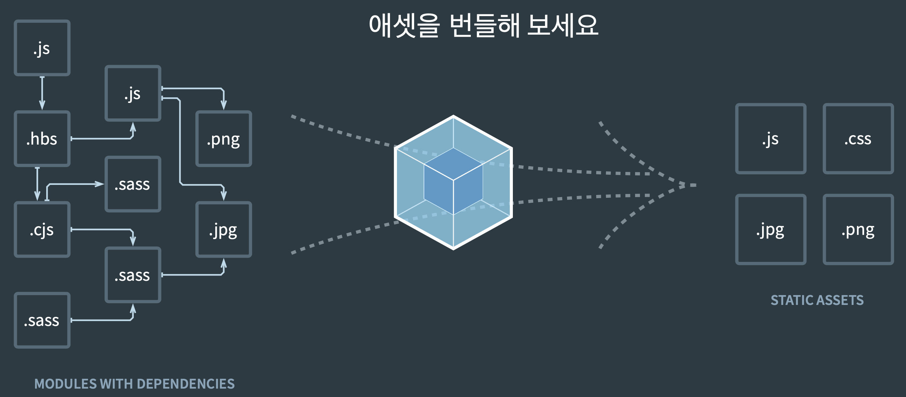
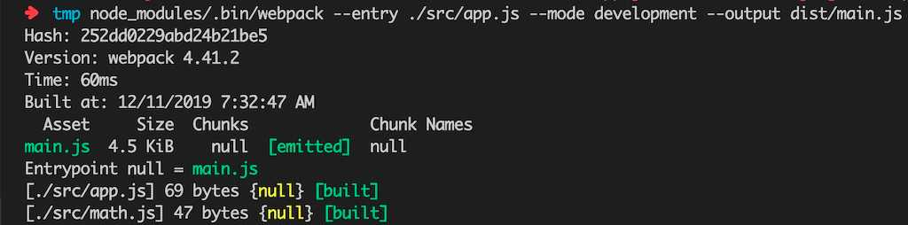
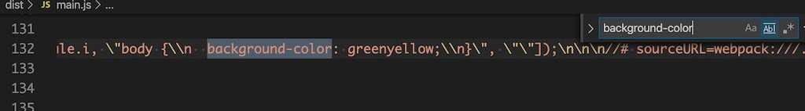
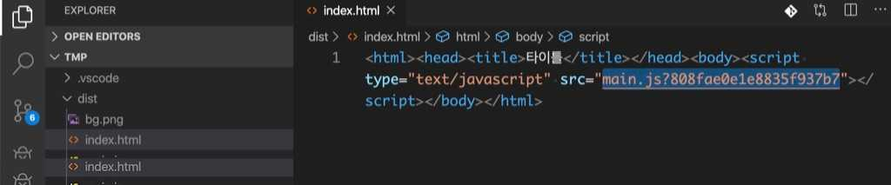
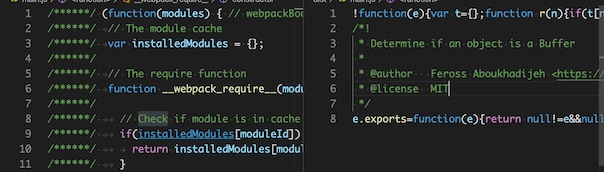
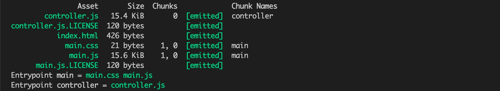
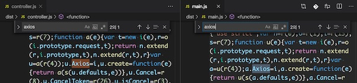

# 프론트엔드 개발에 Node.js가 필요한 이유

몇 년 전부터 프론트엔드 개발자 채용 공고에 Node.js 기술이 우대 사항 항목으로로 추가 되었다. Node.js는 백엔드를 구현하는 기술이라고 생각했다면 이 채용 항목이 의문이었을지 모르겠다. 웹 어플리케이션 개발에 직접적으로 사용하는 것은 아니지만 개발 환경을 이해하고 구성하는데 Node.js를 모르면 언젠가는 한계에 부딪히게 될 것이다.

## **최신 스펙으로 개발할 수 있다**

자바스크립트 스펙의 빠른 발전에 비해 브라우져의 지원 속도는 항상 뒤쳐진다. 아무리 편리한 스펙이 나오더라도 이것을 구현해 주는 징검다리 역할, 이를테면 바벨 같은 도구의 도움 없이는 부족하다. 더불어 웹팩, NPM 같은 노드 기술로 만들어진 환경에서 사용할 때 비로소 자동화된 프론트엔드 개발환경을 갖출 수 있다.

마찬가지로 Typescript, SASS 같은 고수준 프로그래밍 언어를 사용하려면 전용 트랜스파일러가 필요하다. 물론 이것 역시 Node.js 환경이 뒷받침 되어야 우리가 말하는 프론트엔드 개발 환경을 만들 수있다.

## **빌드 자동화**

과거처럼 코딩 결과물을 브라우져에 바로 올리는 경우는 흔치 않다. 파일을 압축하고, 코드를 난독화하고, 폴리필을 추가하는 등 개발 이외의 작업을 거친후 배포한다. Node.js는 이러한 일련의 빌드 과정을 이해하는데 적지 않은 역할을 한다. 뿐만 아니라 라이브러리 의존성을 해결하고, 각종 테스트를 자동화하는데도 사용된다.

## **개발 환경 커스터마이징**

각 프레임워크에서 제공하는 도구를 사용하면 손쉽게 개발환경을 갖출수 있다. React.js의 CRA(create-react-app), Vuejs 의 vue-cli를 사용한다면 말이다. 그러나 개발 프로젝트는 각자의 형편이라는 것이 있어서 툴을 그대로 사용할 수 없는 경우도 빈번하다. 커스터마이징 하려면 Node.js 지식이 필요하다. 어쩌면 자동화된 도구를 사용할 수 없는 환경이라면 직접 환경을 구축해야 할 상황에 놓일 수도 있다.

# 모듈(Module)

## 배경

```jsx
//math.js
function sum(a, b) {
  return a + b
}

//app2.js
var sum = 1;

//app.js
sum(1, 2);

<html>
	<head>
		<script type=“text/javascript” src=“math.js”></script>
		<script type=“text/javascript” src=“app2.js”></script>
		<script type=“text/javascript” src=“app.js”></script>
	</head>
</html>
```

모듈 개념이 없던 시절에는 모든 스크립트를 html에서 로딩해야 사용이 가능했다. 스크립트 들의 모든 요소들은 전역 공간에서 함께 존재하므로 이름 공간에서 충돌일 발생할 수 있었다. 예를 들어 위 코드에서는 app2.js에서 sum이라는 이름을 덮어쓰면서 런타임 오류가 발생하게 되는 것이다.

## IIFE 방식의 모듈

위와 같은 충돌 문제를 방지하기 위해서는 스코프 개념이 필요하다. 스코프 내로 이름 공간을 격리해서 충돌 문제를 해결하는 것이다. 아래 코드에서는 `IIFE`라는 즉시 실행 함수의 형태로 스코프를 구현한다.

```jsx
//math.js
var math = math || {}; // math 네임스페이스

(function () {
  function sum(a, b) {
    return a + b;
  }
  math.sum = sum; // 네임스페이스에 추가
})();
```

## 다양한 모듈 스펙

### CommonJS

대표적으로 `Node.js`에서 활용하는 방법으로, `exports 키워드`로 모듈을 만들고 `require()` 함수로 불러 들이는 방식이다.

```jsx
// math.js
exports function sum(a, b) { return a + b; }

// app.js
const math = require("./math.js")
math.sum(1, 2);
```

### AMD

`AMD(Asynchronous Module Definition)`는 비동기로 로딩되는 환경에서 모듈을 사용하는 것이 목표다. 주로 브라우져 환경이다.

### UMD

`UMD(Universal Module Definition)`는 AMD 기반으로 CommonJS 방식까지 지원하는 통합 형태이다.

### ES2015 표준 모듈 시스템

이렇게 각 커뮤니티에서 각자의 스펙을 제안하다가 ES2015에서 표준 모듈 시스템이 제안되었다. `export 구문`으로 모듈을 만들고 `import 구문`으로 가져올 수 있다.

```jsx
// math.js
export function sum(a, b) {
  return a + b;
}

// app.js
import * as math from "./math.js";
math.sum(1, 2);
```

### 브라우져의 모듈 지원

현재 모든 브라우져에서 모듈 시스템을 지원하지는 않는다. 인터넷 익스플로러를 포함한 몇 몇 브라우져에서는 여전히 모듈을 사용하지 못한다. 가장 많이 사용하는 크롬 역시 버전 61부터 아래와 같은 방식으로 모듈 시스템을 지원한다.

```html
<script type="module" src="app.js"></script>
```

그리고 브라우저에 무관하게 모듈을 사용하고 싶은 니즈에 따라 `웹팩`이 등장하게 되었다.

# Webpack



웹팩은 **여러 개 파일을 하나의 파일로 합쳐주는 번들러(bundler)**이다. `하나의 시작점(entry point)`으로부터 의존적인 모듈을 전부 찾아내서 하나의 결과물을 만들어 낸다.

```bash
$ npm install -D webpack webpack-cli
$ node_modules/.bin/webpack --mode development --entry ./src/app.js --output dist/main.js
```

- `—mode`는 웹팩 실행 모드로 개발 버전인 development를 지정한다.
- `—entry`는 시작점 경로를 지정하는 옵션이다.
- `—output`은 번들링 결과물을 위치할 경로이다.



산출물인 `dist/main.js`는 이전 모든 모듈 파일과 동일한 결과를 만든다.

## webpack.config.js

명령어를 통해 번들링하는 경우 번거러울 수 있다(라임..) `--config` 옵션을 통해 웹팩 설정파일의 경로를 지정할 수 있는데 기본 파일명은 `webpack.config.js` 혹은 `webpackfile.js`이다.

```jsx
// webpack.config.js
const path = require("path");

module.exports = {
  mode: "development",
  entry: {
    main: "./src/app.js",
  },
  output: {
    filename: "[name].js",
    path: path.resolve("./dist"),
  },
};
```

이제 파라메터를 설정파일 통해 전달할 수 있으므로 package.json을 통해 스크립트를 작성하여 편하게 번들링이 가능하다.

```json
// package.json
{
  "scripts": {
    "build": "./node_modules/.bin/webpack"
  }
}
```

## 로더(Loader)

**웹팩은 모든 파일을 모듈로** 바라본다. 자바스크립트로 만든 모듈 뿐만 아니라 **스타일시트, 이미지, 폰트까지도 전부 모듈로 보기 때문에 import 구문을 사용하면 자바스크립트 코드 안으로** 가져올 수 있다. 이것이 가능한 이유는 웹팩의 `로더` 덕분이다. 로더는 타입스크립트 같은 다른 언어를 자바스크립트 문법으로 변환해 주거나 이미지를 data URL 형식의 문자열로 변환한다. 뿐만아니라 CSS 파일을 자바스크립트에서 직접 로딩할수 있도록 해준다.

### 커스텀 로더 만들기

실제로 로더를 직접 작성하는 경우는 드물다. 잘 작성된 로더를 가져와 사용하는 것이 보통이지만 원리 이해를 위해 커스텀 로더를 만들어 보자.

```jsx
// myloader.js
module.exports = function myloader(content) {
  console.log("myloader가 동작함")
  return content.replace("console.log(", "alert(") // console.log(를 alert(로 치환
}

// webpack.config.js
module: {
  rules: [{
    test: /\\.js$/, // .js 확장자로 끝나는 모든 파일
    use: [path.resolve('./myloader.js')] // 방금 만든 로더를 적용한다
  }],
}
```

`test`에는 로딩에 적용할 파일을 지정한다. 파일명 뿐만아니라 파일 패턴을 정규표현식으로 지정할 수 있다. `use`에는 이 패턴에 해당하는 파일에 적용할 로더를 설정하는 부분이다. 번들링을 진행해보면 터미널에 'myloader가 동작함' 문자열이 찍힌다. myloader() 함수가 동작한 것이다. 결과물인 `dist/main.js`를 살펴보면 파일의 모든 console.log가 alert으로 대체됨을 확인할 수 있다.

### 자주 사용하는 로더

- css-loader

웹팩은 모든것을 모듈로 바라보기 때문에 자바스크립트 뿐만 아니라 **스타일시트도 import 구문으로 불러 올 수 있다.** 아래와 같이 자바스크립트에서 CSS 파일을 불러와 사용하기 위해서는 CSS를 모듈로 변환하는 작업이 필요하다. `css-loader`가 그런 변환 작업을 담당한다.

```jsx
// app.js
import "./style.css"

// style.css
body {
  background-color: green;
}
```

우선 `css-loader`를 설치하고 웹팩에 설정을 추가하자.

```bash
$ npm install -D css-loader
```

```jsx
// webpack.config.js
module.exports = {
  module: {
    rules: [
      {
        test: /\\.css$/, // .css 확장자로 끝나는 모든 파일
        use: ["css-loader"], // css-loader를 적용한다
      },
    ],
  },
};
```

use.loader에 로더 경로를 설정하는 대신 배열에 로더 이름을 문자열로 전달해도 된다. 빌드 한 결과, 아래와 같이 CSS코드가 자바스크립트로 변환된 것을 확인할 수 있다.



- style-loader

모듈로 변경된 스타일 시트는 DOM에 추가되어야만 브라우져가 해석할 수 있다. `css-loader`로 처리하면 **자바스크립트 코드로만 변경되었을 뿐** DOM에 적용되지 않았기 때문에 스트일이 적용되지 않았다. `style-loader`는 자바스크립트로 변경된 스타일을 동적으로 DOM에 추가하는 로더이다. CSS를 번들링하기 위해서는 **css-loader와 style-loader를 함께** 사용한다.

```jsx
// webpack.config.js
module.exports = {
  module: {
    rules: [
      {
        test: /\\.css$/,
        use: ["style-loader", "css-loader"], // style-loader를 앞에 추가한다
      },
    ],
  },
};
```

**배열로 설정하면 뒤에서부터 앞으로 순서대로 로더가 동작**한다.

- file-loader

CSS 뿐만 아니라 소스코드에서 사용하는 모든 파일을 모듈로 사용할 수 있다. 파일을 모듈 형태로 지원하고 웹팩 아웃풋에 파일을 옮겨주는 것이 `file-loader`가 하는 일이다. 가령 CSS에서 url() 함수에 이미지 파일 경로를 지정할 수 있는데 웹팩은 file-loader를 이용해서 이 파일을 처리한다.

```css
body {
  background-image: url(bg.png);
}
```

위와 같이 이미지 파일에 대해서도 file-loader를 통해 모듈로서 번들링할 수 있다.

```jsx
webpack.config.js:
module.exports = {
  module: {
    rules: [
      {
        test: /\\.png$/, // .png 확장자로 마치는 모든 파일
        loader: "file-loader",
        options: {
          publicPath: "./dist/", // prefix를 아웃풋 경로로 지정
          name: "[name].[ext]?[hash]", // 파일명 형식
        },
      },
    ],
  },
}
```

이번에는 `options` 필드가 추가되었다. CSS 코드는 기존과 동일한 경로에서 이미지를 찾으려하겠지만 웹팩으로 빌드된 이미지 파일은 output으로 지정한 경로로 이동했기 때문에 이미지가 정상적으로 출력되지 않는다.

`publicPath 옵션`은 file-loader가 처리하는 파일을 모듈로 사용할 때 경로 앞에 추가되는 문자열이다. 파일을 사용하는 측에서는 **bg.png를 dist/bg.png로 변경하여 사용**할 것이다. 또한 `name 옵션`을 사용했는데 이것은 로더가 파일을 아웃풋에 복사할때 사용하는 파일 이름이다. 기본적으로 설정된 해쉬값을 쿼리스트링으로 옮겨서 `bg.png?6453a9c65953c5c28aa2130dd437bbde` 형식으로 파일을 요청하도록 변경했다.

- url-loader

사용하는 이미지 개수가 많다면 네트워크 리소스를 사용하는 부담이 있고 사이트 성능에 영향을 줄 수도 있다. 이런 경우 작은 이미지 등은 `Data URI Scheme`을 사용하는게 좋을 수도 있다. 이미지를 Base64로 인코딩하여 문자열 형태로 소스코드에 넣는 형식이다.

```jsx
webpack.config.js:
{
  test: /\\.png$/,
  use: {
    loader: 'url-loader', // url 로더를 설정한다
    options: {
      publicPath: './dist/', // file-loader와 동일
      name: '[name].[ext]?[hash]', // file-loader와 동일
      limit: 5000 // 5kb 미만 파일만 data url로 처리
    }
  }
}
```

file-loader와 옵션 설정이 거의 비슷하고 마지막 `limit 속성`만 추가했다. 모듈로 사용한 파일중 크기가 5kb 미만인 파일만 url-loader를 적용하는 설정이다.

## 플러그인(Plugin)

로더가 파일 단위로 처리하는 반면 **플러그인은 번들된 결과물을 처리**한다. 번들된 자바스크립트를 `난독화`한다거나 `특정 텍스트를 추출하는 용도`로 사용한다.

### 커스텀 플러그인 만들기

플러그인 역시 로더처럼 직접 작성하여 사용하는 일은 드물지만 이해를 위해 직접 작성해보자. 플러그인은 클래스로 제작한다. apply 함수에 원하는 내용을 구현하면 된다.

```jsx
// myplugin.js
class MyPlugin {
  apply(compiler) {
    compiler.plugin('emit', (compilation, callback) => {
      const source = compilation.assets['main.js'].source();
      compilation.assets['main.js'].source = () => {
        const banner = [
          '/**',
          ' * 이것은 BannerPlugin이 처리한 결과입니다.',
          ' * Build Date: 2019-10-10',
          ' */'
          ''
        ].join('\\n');
        return banner + '\\n' + source;
      }

      callback();
    })
  }
}
module.exports = MyPlugin
```

번들링된 결과 위에 배너를 붙이는 코드이다. 위와 같이 플러그인을 작성한 뒤, 아래와 같이 설정에 플러그인을 추가한다.

```jsx
// webpack.config.js
const MyPlugin = require("./myplugin");

module.exports = {
  plugins: [new MyPlugin()],
};
```

### 자주 사용하는 플러그인

- BannerPlugin

위 예제에서 작성한 것처럼 결과물 위에 배너를 작성해주는 플러그인이다.

- DefinePlugin

환경변수를 설정하기 위한 플러그인이다. `dot-env` 라이브러리처럼 환경변수를 활용하는데 유용하다.

```jsx
// webpack.config.js
new webpack.DefinePlugin({
  VERSION: JSON.stringify("v.1.2.3"),
  PRODUCTION: JSON.stringify(false),
  MAX_COUNT: JSON.stringify(999),
  "api.domain": JSON.stringify("<http://dev.api.domain.com>"),
});

// app.js
console.log(VERSION); // 'v.1.2.3'
console.log(PRODUCTION); // true
console.log(MAX_COUNT); // 999
console.log(api.domain); // '<http://dev.api.domain.com>'
```

- HtmlWebpackPlugin

HTML 파일을 후처리하는 플러그인으로 코드를 압축할 수 있다. 개발 환경과 달리 운영 환경에서는 파일을 압축하고 불필요한 주석을 제거하는 것이 좋다.

```jsx
// webpack.config.js
new HtmlWebpackPlugin({
  minify: process.env.NODE_ENV === 'production' ? {
    collapseWhitespace: true, // 빈칸 제거
    removeComments: true, // 주석 제거
  } : false,
  hash: true	// 정적 파일을 불러올때 쿼리문자열에 웹팩 해쉬값을 추가한다
}
```



- CleanWebpackPlugin

빌드 이전 결과물을 제거하는 플러그인이다. 빌드 결과물은 아웃풋 경로에 모이는데 과거 파일이 남아 있을수 있다. 이전 빌드내용이 덮여 씌여지면 상관없지만 그렇지 않으면 아웃풋 폴더에 여전히 남아 있을 수 있다.

- MiniCssExtractPlugin

스타일시트가 점점 많아지면 하나의 자바스크립트 결과물로 만드는 것이 부담일 수 있다. 번들 결과에서 스트일시트 코드만 뽑아서 별도의 CSS 파일로 만들어 역할에 따라 파일을 분리하는 것이 좋다. 브라우저에서 큰 파일 하나를 내려받는 것 보다, 여러 개의 작은 파일을 동시에 다운로드하는 것이 더 빠르다. 개발 환경에서는 CSS를 하나의 모듈로 처리해도 상관없지만 프로덕션 환경에서는 분리하는 것이 효과적이다. MiniCssExtractPlugin은 CSS를 별로 파일로 뽑아내는 플러그인이다.

```jsx
// webpack.config.js
const MiniCssExtractPlugin = require("mini-css-extract-plugin");

module.exports = {
  plugins: [
    ...(process.env.NODE_ENV === "production"
      ? [new MiniCssExtractPlugin({ filename: `[name].css` })]
      : []),
  ],
};
```

## Babel과 번들링(Bundling)

사용하는 말이 달라서 바벨탑이 실패했듯이, 브라우저마다 사용하는 언어가 달라서 프론트엔트 코드는 일관적이지 못할 때가 많다. 스팩과 브라우져가 개선되고 있지만, 여전히 인터넷 익스플로러는 `Promise`를 이해하지 못한다. 작년까지만 해도 사파리 최신 브라우져는 `Promise.prototype.finally` 메소드를 사용할 수 없었다. 프론트엔드 개발에서 크로스 브라우징 이슈는 코드의 일관성을 해치고 초심자를 불안하게 만든다. 히브리어로 바벨이 '혼돈'이란 뜻인 것처럼 말이다.

크로스 브라우징의 혼란을 해결해 줄 수 있는 것이 바벨이다. ECMAScript2015+로 작성한 코드를 모든 브라우져에서 동작하도록 **트랜스파일**을 통해 호환성을 지켜준다. 타입스크립트, JSX처럼 다른 언어로 분류되는 것도 포함한다.

```bash
npm install -D @babel/core  @babel/cli
npx babel app.js
```

하지만 위와 같이 바벨을 실행해도 아무런 변화는 없을 것이다. 바벨 역시 웹팩처럼 플러그인을 통해 원하는 동작을 만들어내는데 위 명령에서는 아무런 플러그인도 사용하지 않았기 때문이다.

### 플러그인

- 커스텀 플러그인

바벨의 플러그인 역시 직접 만들어 사용하는 일은 거의 없지만 커스텀 플러그인을 만들며 원리를 이해해보자.

```jsx
// myplugin.js
module.exports = function myplugin() {
  return {
    visitor: {
      VariableDeclaration(path) {
        console.log("VariableDeclaration() kind:", path.node.kind); // const

        if (path.node.kind === "const") {
          path.node.kind = "var";
        }
      },
    },
  };
};
```

`const`를 `var`로 변환하는 플러그인이다. 아래와 같이 플러그인을 지정하여 실행할 수 있다.

```bash
npx babel app.js --plugins ./myplugin.js
```

- 설정 파일

쉬운 사용을 위해 `webpack.config.js`처럼 바벨에 대한 설정파일을 만들 수 있다.

```jsx
// babel.config.js:
module.exports = {
  plugins: [
    "@babel/plugin-transform-block-scoping",
    "@babel/plugin-transform-arrow-functions",
    "@babel/plugin-transform-strict-mode",
  ],
};
```

### 프리셋

ECMAScript2015+으로 코딩할 때 필요한 플러그인을 일일이 설정하는 일은 무척 지난한 일이다. 목적에 맞게 여러가지 플러그인을 세트로 모아놓은 것을 "**프리셋**"이라고 한다.

- 커스텀 프리셋

```jsx
// mypreset.js
module.exports = function mypreset() {
  return {
    plugins: [
      "@babel/plugin-transform-arrow-functions",
      "@babel/plugin-transform-block-scoping",
      "@babel/plugin-transform-strict-mode",
    ],
  };
};

// babel.config.js
module.exports = {
  presets: ["./mypreset.js"],
};
```

- 프리셋 종류

  - `preset-env`: ECMAScript2015+를 변환할 때 사용
  - `preset-flow`
  - `preset-react`
  - `preset-typescript`

- 타겟 브라우져

target 옵션에 브라우져 버전을 지정하면, `env 프리셋`은 맞는 플러그인들을 찾아 최적의 코드를 출력해 낸다.

```jsx
// babel.config.js
module.exports = {
  presets: [
    [
      "@babel/preset-env",
      {
        targets: {
          chrome: "79", // 크롬 79까지 지원하는 코드를 만든다
        },
      },
    ],
  ],
};
```

### 폴리필(Polyfill)

`new Promise()`를 바벨로 처리하면 `new Promise()`가 나온다. 플러그인이 프라미스를 ECMAScript5 버전으로 변환할 것으로 기대했는데 예상과 다르다. 바벨은 **ECMAScript2015+를 ECMAScript5 버전으로 변환할 수 있는 것만 빌드한다.** 그렇지 못한 것들은 "**폴리필**"이라고 부르는 코드조각을 추가해서 해결한다.

env 프리셋은 폴리필을 지정할 수 있는 옵션을 제공한다.

```jsx
// babel.config.js:
module.exports = {
  presets: [
    [
      "@babel/preset-env",
      {
        useBuiltIns: "usage", // 폴리필 사용 방식 지정
        corejs: {
          // 폴리필 버전 지정
          version: 2,
        },
      },
    ],
  ],
};
```

결과물은 아래와 같이 나오게 된다.

```jsx
"use strict";
require("core-js/modules/es6.promise");
require("core-js/modules/es6.object.to-string");

new Promise();
```

### 웹팩으로 통합

실무 환경에서는 바벨을 직접 사용하는 것보다는 웹팩으로 통합해서 사용하는 것이 일반적이다. 로더 형태로 제공하는데 `babel-loader`가 그것이다.

```jsx
// webpack.config.js
module.exports = {
  module: {
    rules: [
      {
        test: /\\.js$/,
        exclude: /node_modules/,
        loader: "babel-loader", // 바벨 로더를 추가한다
      },
    ],
  },
};
```

## 웹팩 개발 서버

운영 환경에서는 서버에서 파일을 읽고 요청한 클라이언트에게 그것을 제공한다. 개발 환경에서도 유사한 환경을 갖추기 위해 개발자에게 개발용 서버를 제공해 주는 것이 `webpack-dev-server`이다.

```bash
$ npm i -D webpack-dev-server
$ webpack-dev-server

｢wds｣: Project is running at <http://localhost:8080/>
｢wds｣: webpack output is served from /
｢wds｣: Content not from webpack is served from
```

위와 같이 webpack-dev-server를 설치하고 구동하면 8080 포트를 통해 서버가 구동되고, 웹팩의 아웃풋 경로인 dist를 루트 경로를 통해 접속할 수 있다. 그리고 아주 편리한 점은 **웹팩 서버는 파일 변화를 감지하면 웹팩 빌드를 다시 수행하고 브라우저를 리프레시하여 변경된 결과물을 보여준다.**

### 기본 설정

```jsx
// webpack.config.js
module.exports = {
  devServer: {
    contentBase: path.join(__dirname, "dist"), // 정적 파일을 제공할 경로. 기본값은 웹팩 아웃풋.
    publicPath: "/", // 브라우저를 통해 접근하는 경로
    host: "dev.domain.com", // cors 문제 등 개발 환경에서 도메인을 맞춰야 하는 경우 사용
    overlay: true, // 빌드시 에러나 경고를 브라우저 화면에 표시한다.
    port: 8081,
    stats: "errors-only", // 메시지 수준(none, errors-only, minimal, normal, verbose)
    historyApiFallback: true, // 404가 발생하면 index.html로 리다이렉트한다.
  },
};
```

### 목업 API 기능

웹팩 개발 서버는 `express` 서버를 이용하여 요청에 대한 **목업 Response**를 전달할 수 있는 기능이 있다. 협업 단계에서 프론트엔드가 기능을 테스트하는데 유용하다.

```jsx
// webpack.config.js
module.exports = {
  devServer: {
    before: (app, server, compiler) => {
      app.get("/api/keywords", (req, res) => {
        res.json([
          { keyword: "이탈리아" },
          { keyword: "세프의요리" },
          { keyword: "제철" },
          { keyword: "홈파티" },
        ]);
      });
    },
  },
};
```

### connect-api-mocker

목업 API를 많이 작성해야 하는 경우 `webpack.config.js`에서 모두 작성하기가 쉽지 않다. 이때는 `connect-api-mocker` 패키지를 통해 특정 목업 폴더에 응답을 담은 파일을 저장해서 이용할 수 있다.

```bash
npm i -D connect-api-mocker
```

```json
// mocks/api/keywords/GET.json

GET.json:
[
  { "keyword": "이탈리아" },
  { "keyword": "세프의요리" },
  { "keyword": "제철" },
  { "keyword": "홈파티 " }
]
```

```jsx
// webpack.config.js
const apiMocker = require("connect-api-mocker");

module.exports = {
  devServer: {
    before: (app, server, compiler) => {
      app.use(apiMocker("/api", "mocks/api"));
    },
  },
};
```

### 프록시 설정

`CORS 문제` 등이 발생하였을 때 프록시를 설정해서 해결할 수 있다.

```jsx
// webpack.config.js
module.exports = {
  devServer: {
    proxy: {
      "/api": "<http://localhost:8081>", // 프록시
    },
  },
};
```

이제 개발서버에 들어온 모든 http 요청 중 /api로 시작되는것은 `http://localhost:8081`로 요청된다.

## 핫 모듈 리플레이스먼트(Hot Module Replacement)

웹팩 개발서버는 코드 변화를 감지하면 전체 화면을 갱신한다. `HMR(Hot Module Replacement)`는 변경된 모듈만은 바꿔치기해서 성능을 높히는 기능이다. 설정은 아래와 같이 간단하다.

```jsx
// webpack.config.js
module.exports = {
  devServer = {
    hot: true,
  },
}
```

- 핫로딩을 지원하는 로더

`style-loader`, `react-hot-loader`, `file-loader`와 같은 로더들은 HMR 인터페이스를 구현하여 핫 로딩을 지원한다.

## 웹팩 최적화

코드가 많아지면 번들링된 결과물도 커지기 마련이다. 거의 메가바이트 단위로 커질수도 있는데 이는 브라우저 성능에 영향을 줄 수 있다. 파일을 다운로드하는데 시간이 많이 걸리기 때문이다. 이를 방지하기 위한 최적화 방법은 아래와 같다.

### production 모드

모드가 변경되면 사용하는 플러그인이 달라진다.

- development 모드의 경우, `NamedChunksPlugin`, `NamedModulesPlugin`
- production 모드의 경우,
  `FlagDependencyUsagePlugin`, `FlagIncludedChunksPlugin`, `ModuleConcatenationPlugin`, `NoEmitOnErrorsPlugin`, `OccurrenceOrderPlugin`, `SideEffectsFlagPlugin`, `TerserPlugin`

따라서 아래와 같이 결과물이 확연한 차이를 보이게 된다.



### optimazation 속성

- optimize-css-assets-webpack-plugin

`HtmlWebpackPlugin`이 html 파일을 압축한 것처럼, CSS 파일도 빈칸을 없애는 압축을 할 수 있다.

```jsx
// webpack.config.js:
const OptimizeCSSAssetsPlugin = require("optimize-css-assets-webpack-plugin");

module.exports = {
  optimization: {
    minimizer: mode === "production" ? [new OptimizeCSSAssetsPlugin()] : [],
  },
};
```

```css
body {
  background: #fff;
}
```

- terser-webpack-plugin

자바스크립트 코드를 난독화하고, debugger 구문을 제거하며 옵션에 따라 콘솔 로그를 제거할 수 있는 플러그인이다.

```jsx
// webpack.config.js:
const TerserPlugin = require("terser-webpack-plugin");

module.exports = {
  optimization: {
    minimizer:
      mode === "production"
        ? [
            new TerserPlugin({
              terserOptions: {
                compress: {
                  drop_console: true, // 콘솔 로그를 제거한다
                },
              },
            }),
          ]
        : [],
  },
};
```

### 코드 스플리팅(Code Splitting)

코드를 압축하는 것 외에도, 아예 결과물을 여러 개로 쪼개면 좀 더 브라우저 다운로드 속도를 높일 수 있다. 큰 파일 하나를 다운로드 하는것 보다 작은 파일 여러개를 동시에 다운로드하는 것이 더 빠르기 때문이다.

가장 단순한 것은 **엔트리를 여러 개로 분리**하는 것이다.

```jsx
// webpack.config.js
module.exports = {
  entry: {
    main: "./src/app.js",
    controller: "./src/controller.js",
  },
};
```

빌드하면 엔트리가 두 개 생성되고 아래와 같이 하나의 엔트리일 때보다 용량이 조금 줄었다.



하지만 두 파일을 비교해 보면 중복 코드가 있다. axios 모듈인데 main, controller 둘 다 axios를 사용하기 때문이다.



이를 해결할 수 있는 `SplitChunksPlugin`은 코드를 분리할때 중복을 예방하는 플러그인이다.

```jsx
// webpack.config.js:
module.exports = {
  optimization: {
    splitChunks: {
      chunks: "all",
    },
  },
};
```

### 다이나믹 임포트(Dynamic Import)

이런 방식은 엔트리 포인트를 적절히 분리해야기 때문에 손이 많이 가는 편이다. 반면 자동으로 변경해 주는 방식이 있는데 이를 **다이나믹 임포트**라고 부른다. 다이나믹 임포트로 모듈을 가져오면 단일 엔트리를 유지하면서 코드를 분리할 수 있다.

```jsx
function getController() {
  return import("./controller").then((m) => {
    return m.default;
  });
}

document.addEventListener("DOMContentLoaded", () => {
  getController().then((controller) => {
    controller.init(document.querySelector("#app"));
  });
});
```

### externals

`axios`같은 써드파티 라이브러리는 패키지로 제공될때 이미 빌드 과정을 거쳤기 때문에 빌드 프로세스에서 제외하는 것이 좋다. 웹팩 설정 중 `externals`가 이러한 기능을 제공한다.

```jsx
// webpack.config.js
module.exports = {
  externals: {
    axios: "axios",
  },
};
```

이와 같이 사용하는 경우 `axios`는 이미 `node_modules`에 위치해 있기 때문에, 이를 웹팩 아웃풋 폴더에 옮기고 `index.html`에서 로딩해야한다. 이를 위해 파일을 복사하는 `CopyWebpackPlugin`을 사용해서 라이브러리를 복사한다.

```jsx
const CopyPlugin = require("copy-webpack-plugin");

module.exports = {
  plugins: [
    new CopyPlugin([
      {
        from: "./node_modules/axios/dist/axios.min.js",
        to: "./axios.min.js", // 목적지 파일에 들어간다
      },
    ]),
  ],
};
```

```html
<script type="text/javascript" src="axios.min.js"></script>
```

---

[1] 인프런, 프론트엔드 개발환경의 이해와 실습, 김정환
